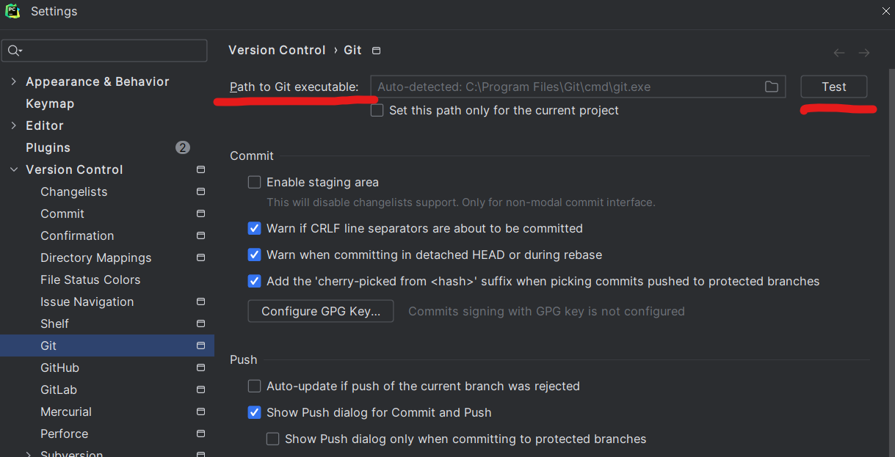
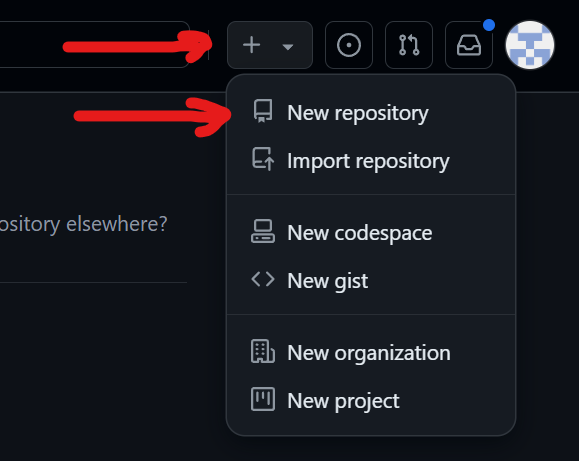
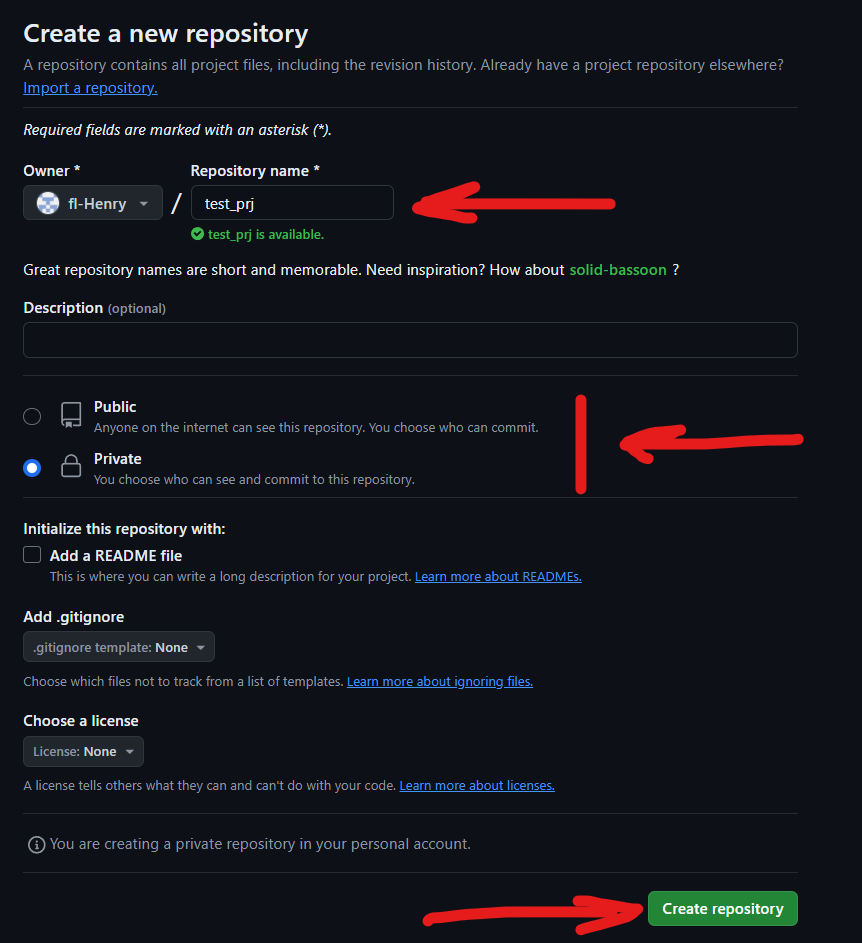
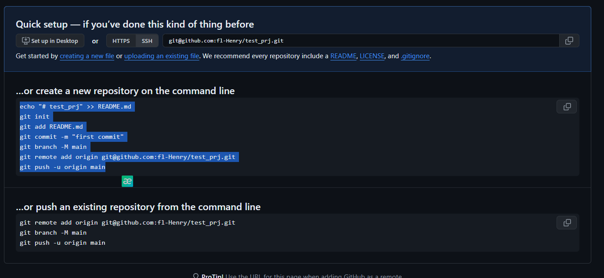
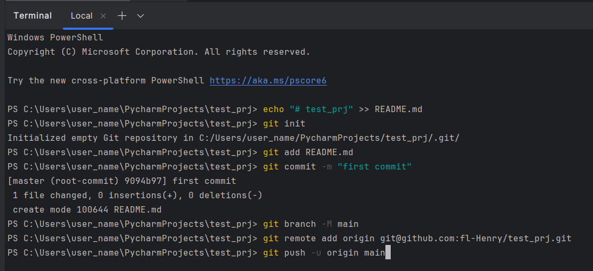
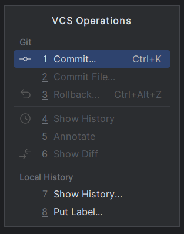

<h2 id="ml12">Занятие 12: Введение в Git и Docker</h2>

### 1. Введение в работу с Git в PyCharm

#### Настройка Git в PyCharm

1. **Установка Git**: Убедитесь, что Git установлен на вашем компьютере. Если нет, скачайте и установите его с официального сайта.
- https://git-scm.com/downloads

2. **Конфигурация Git в PyCharm**:
   - Перейдите в `File > Settings > Version Control > Git` (или `PyCharm > Preferences` на macOS).
   - В поле `Path to Git executable` укажите путь к исполняемому файлу Git (по умолчанию PyCharm должен найти его автоматически).
   - Нажмите `Test` для проверки правильности настройки.
   

#### Инициализация репозитория

1. **Создание нового проекта**: Откройте PyCharm и создайте новый проект или откройте существующий.

2. **Инициализация Git**:
   - Создайте новый репозиторий на GitHub  
   
   - Введите имя, укажите приватность репозитория и нажмите "создать   репозиторий"
    
   - Скопируйте первый snippet и запустите в терминале проекта  
     
   
   - По нажатию сочетаний клавиш `alt + ~` можно вызвать окно с доступными действиями    
   

#### Добавление и коммит изменений
1. **Добавление изменений**:
   - Внесите изменения в файлы проекта.
   - Перейдите в `VCS > Commit` или используйте комбинацию клавиш `Ctrl+K` (Cmd+K на macOS).
   - В диалоге коммита выберите файлы для добавления в индекс (стейджинг).
2. **Коммит изменений**:
   - Введите сообщение коммита в соответствующее поле.
   - Выберите дополнительные параметры, такие как `Amend commit` или `Commit and Push`.
   - Нажмите `Commit` для сохранения изменений в локальном репозитории.

#### Просмотр истории коммитов
1. **Открытие истории**:
   - Перейдите в `VCS > Git > Show History` или используйте комбинацию клавиш `Alt+9` (Option+9 на macOS).
   - История коммитов отображается в нижней панели PyCharm.
2. **Анализ коммитов**:
   - Вы можете просматривать список коммитов, фильтровать их по различным критериям и видеть подробную информацию о каждом коммите, включая измененные файлы и сообщения коммита.

#### Работа с ветками
1. **Создание и переключение веток**:
   - Перейдите в `VCS > Git > Branches` или используйте нижнюю панель с выпадающим меню веток.
   - Выберите `New Branch` для создания новой ветки и введите ее имя.
   - Выберите ветку, на которую хотите переключиться, из списка существующих веток.
2. **Слияние веток**:
   - Перейдите в `VCS > Git > Merge Changes`.
   - Выберите ветку для слияния и нажмите `Merge`.
   - Разрешите возможные конфликты, если они возникают, и завершите процесс слияния.

### 2. Введение в работу с Docker в PyCharm

Работа с Docker в PyCharm позволяет вам использовать контейнеризацию для разработки, тестирования и развертывания приложений. В этом разделе мы рассмотрим основные шаги для настройки и использования Docker в PyCharm, включая создание Dockerfile, построение и запуск контейнеров, а также управление ими.

#### 2.1 Настройка Docker в PyCharm

1. **Установка Docker:**
   - Убедитесь, что Docker установлен и работает на вашей машине. Вы можете скачать Docker Desktop для Windows или macOS с официального сайта [Docker](https://www.docker.com/products/docker-desktop) или установить Docker на Linux через пакетный менеджер.

2. **Настройка Docker в PyCharm:**
   - Откройте PyCharm.
   - Перейдите в `File` > `Settings` (или `PyCharm` > `Preferences` на macOS).
   - В меню настроек выберите `Build, Execution, Deployment` > `Docker`.
   - Нажмите кнопку `+` для добавления нового Docker-экземпляра.
   - Выберите тип подключения (например, `Docker for Windows`, `Docker for Mac`, `Unix Socket` для Linux).
   - Проверьте подключение и нажмите `OK`, чтобы сохранить настройки.

3. **Проверка настройки:**
   - Убедитесь, что PyCharm успешно подключился к Docker, проверив, что в разделе `Docker` отображаются ваши контейнеры и образы.

#### 2.2 Создание и настройка Dockerfile

1. **Создание Dockerfile:**
   - В корневой директории вашего проекта создайте файл с именем `Dockerfile` (без расширения).
   - Откройте `Dockerfile` и добавьте основные инструкции для сборки образа. Вот пример простого `Dockerfile` для Python-приложения:

     ```Dockerfile
     # Используем базовый образ Python
     FROM python:3.9-slim

     # Устанавливаем рабочую директорию
     WORKDIR /app

     # Копируем файлы проекта в рабочую директорию
     COPY requirements.txt ./
     COPY . .

     # Устанавливаем зависимости
     RUN pip install --no-cache-dir -r requirements.txt

     # Определяем команду по умолчанию
     CMD ["python", "app.py"]
     ```

2. **Настройка Dockerfile:**
   - В зависимости от вашего приложения, вам может понадобиться добавить дополнительные инструкции. Например, если ваше приложение использует базы данных или другие зависимости, добавьте соответствующие шаги.

#### 2.3 Построение и запуск Docker-контейнеров

1. **Построение Docker-образа:**
   - В PyCharm откройте `Terminal` и перейдите в директорию с вашим `Dockerfile`.
   - Выполните команду для построения образа:

     ```bash
     docker build -t my-python-app .
     ```

   - `-t my-python-app` задает тег для вашего образа (в данном случае `my-python-app`).

2. **Запуск Docker-контейнера:**
   - После построения образа, вы можете запустить контейнер:

     ```bash
     docker run -d -p 5000:5000 my-python-app
     ```

   - `-d` запускает контейнер в фоновом режиме, а `-p 5000:5000` маппит порт 5000 контейнера на порт 5000 вашей машины.

#### 2.4 Управление контейнерами и образами

1. **Просмотр работающих контейнеров:**
   - Используйте команду для просмотра запущенных контейнеров:

     ```bash
     docker ps
     ```

2. **Просмотр всех контейнеров:**
   - Чтобы увидеть все контейнеры, включая остановленные:

     ```bash
     docker ps -a
     ```

3. **Остановка контейнера:**
   - Найдите идентификатор контейнера с помощью `docker ps` и остановите его:

     ```bash
     docker stop <container_id>
     ```

4. **Удаление контейнера:**
   - После остановки контейнера его можно удалить:

     ```bash
     docker rm <container_id>
     ```

5. **Просмотр доступных образов:**
   - Чтобы увидеть все загруженные образы:

     ```bash
     docker images
     ```

6. **Удаление образа:**
   - Удалите ненужные образы по идентификатору или тегу:

     ```bash
     docker rmi <image_id>
     ```
