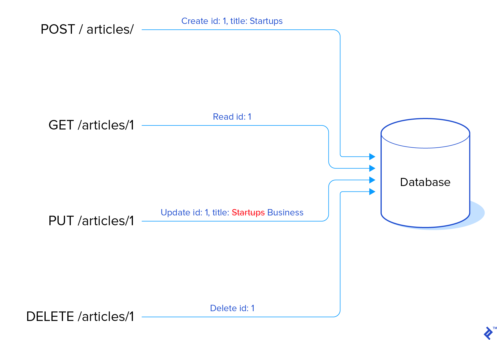
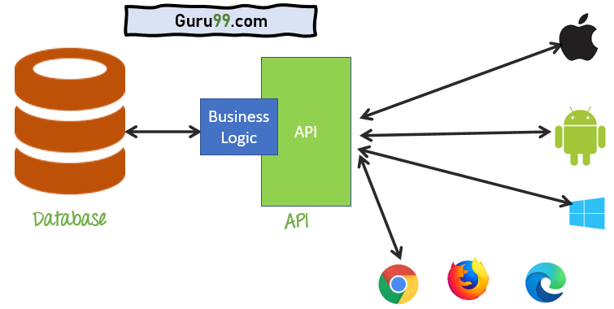

# Занятие 4: Работа с BeautifulSoup и requests

## I. Статус коды ответов, Headers и User-agent, методы
### 1. Статус коды ответов

Статус коды HTTP-ответов предоставляют информацию о результате выполнения запроса. Они помогают понять, был ли запрос обработан успешно или произошла ошибка.

#### 1.1. Основные статус коды

- **200 OK**: Запрос выполнен успешно, и сервер вернул запрашиваемый ресурс.
- **201 Created**: Запрос выполнен успешно, и был создан новый ресурс. Обычно используется в ответ на POST запросы.
- **204 No Content**: Запрос выполнен успешно, но в ответе нет содержимого. Используется, например, после успешного выполнения DELETE запроса.
- **301 Moved Permanently**: Запрашиваемый ресурс был перемещен на новый постоянный URL. В ответе предоставляется новый URL для перенаправления.
- **302 Found**: Запрашиваемый ресурс временно доступен по другому URL. Клиент должен выполнить перенаправление на предоставленный URL.
- **400 Bad Request**: Сервер не может понять запрос из-за синтаксической ошибки. Запрос не может быть обработан.
- **401 Unauthorized**: Запрашиваемый ресурс требует аутентификации. В ответе обычно предоставляется информация о том, как аутентифицироваться.
- **403 Forbidden**: Доступ к ресурсу запрещен, несмотря на наличие правильных учетных данных. Клиент не имеет прав на доступ к ресурсу.
- **404 Not Found**: Ресурс, указанный в запросе, не найден на сервере. URL может быть неверным или ресурс удален.
- **500 Internal Server Error**: Внутренняя ошибка на сервере, запрос не может быть выполнен из-за проблемы на сервере.
- **502 Bad Gateway**: Сервер, действующий как шлюз или прокси, получил неверный ответ от вышестоящего сервера.
- **503 Service Unavailable**: Сервис временно недоступен из-за перегрузки или технических проблем. Временная ошибка, обычно требует повторной попытки позже.

### 2. Headers и User-agent

HTTP-заголовки (Headers) содержат метаинформацию о запросе или ответе, включая данные о клиенте и сервере.

#### 2.1. Headers

- **Content-Type**: Тип содержимого тела ответа (например, `text/html`, `application/json`). Позволяет клиенту интерпретировать данные.
- **Content-Length**: Длина содержимого ответа в байтах.
- **Accept**: Типы данных, которые клиент может обрабатывать. Например, `application/json` для JSON или `text/html` для HTML.
- **Authorization**: Учетные данные для аутентификации, часто в формате `Bearer <token>` для API.
- **User-Agent**: Информация о клиенте, который отправил запрос (например, версия браузера и операционной системы). Помогает серверам адаптировать ответ для конкретного клиента.
- **Cookie**: Данные cookies, которые сервер отправил клиенту и которые клиент включает в запросы.
- **Cache-Control**: Указания для кэширования ответа. Например, `no-cache`, `max-age=3600`.
- **Accept-Language**: Предпочитаемые языки для ответа (например, `en-US`, `fr`).

#### 2.2. User-agent

- **Определение**: User-agent — это строка, отправляемая клиентом (браузером или приложением) в заголовке HTTP-запроса, идентифицирующая клиентское приложение и его версию.
- **Примеры**: 
  - `Mozilla/5.0 (Windows NT 10.0; Win64; x64) AppleWebKit/537.36 (KHTML, like Gecko) Chrome/58.0.3029.110 Safari/537.3`
  - `Mozilla/5.0 (iPhone; CPU iPhone OS 10_3_1 like Mac OS X) AppleWebKit/605.1.15 (KHTML, like Gecko) Version/10.3 Safari/604.1`
- **Назначение**: Используется для предоставления информации о браузере или устройстве, что позволяет серверам адаптировать контент или поведение в зависимости от клиента.

### 3. Методы HTTP: GET, POST, PUT, DELETE

HTTP-методы определяют тип операции, которую клиент хочет выполнить на сервере.  

#### 3.1. GET
- **Цель**: Получение ресурса с сервера.
- **Характеристики**: 
  - Запросы GET могут быть закэшированы.
  - Данные передаются через URL.
  - Не изменяет состояние сервера.
  - Можно использовать параметры запроса в строке URL.

#### 3.2. POST
- **Цель**: Отправка данных на сервер для создания или обработки ресурса.
- **Характеристики**: 
  - Данные передаются в теле запроса.
  - Не кэшируется по умолчанию.
  - Может изменять состояние сервера.
  - Используется для отправки форм, создания новых ресурсов.

#### 3.3. PUT
- **Цель**: Обновление существующего ресурса на сервере.
- **Характеристики**: 
  - Данные передаются в теле запроса.
  - Полностью заменяет ресурс по указанному URL.
  - Если ресурс не существует, может создать новый (в зависимости от реализации сервера).

#### 3.4. DELETE
- **Цель**: Удаление ресурса с сервера.
- **Характеристики**: 
  - Запрос удаляет указанный ресурс.
  - Не возвращает содержимое, обычно возвращает статус код 204 (No Content) или 200 (OK) при успешном удалении.

### 4. Различие между GET и POST запросами

#### 4.1. GET
- **Цель**: Запрос данных с сервера.
- **Параметры**: Передаются в URL (строке запроса).
- **Безопасность**: Менее безопасен для передачи конфиденциальной информации, так как данные видны в URL.
- **Кэширование**: Запросы могут быть закэшированы браузерами или прокси-серверами.
- **Размер данных**: Ограничен длиной URL (обычно до нескольких килобайт).

#### 4.2. POST
- **Цель**: Отправка данных на сервер для создания или обновления ресурсов.
- **Параметры**: Передаются в теле запроса, что позволяет отправлять большие объемы данных.
- **Безопасность**: Более безопасен для передачи конфиденциальной информации, так как данные не видны в URL.
- **Кэширование**: Запросы POST не кэшируются браузерами или прокси-серверами.
- **Размер данных**: Не ограничен длиной URL, позволяет передавать большие объемы данных.

## II. Использование библиотеки fake-headers для обхода блокировки

### 1. Методы блокировки запроса

Сайты и веб-сервисы могут применять различные методы блокировки запросов, чтобы ограничить доступ или предотвратить автоматизированные действия. Вот основные методы:

#### 1.1. По IP-адресу
- **Описание**: Блокировка запросов с определенных IP-адресов или диапазонов IP-адресов.
- **Примеры**: Ограничение доступа к ресурсам для подозрительных или слишком активных IP-адресов.

#### 1.2. По User-Agent
- **Описание**: Блокировка запросов на основе User-Agent строки, которая идентифицирует тип клиента (например, браузер или скрипт).
- **Примеры**: Блокировка известных User-Agent строк автоматизированных скриптов (например, `python-requests`, `curl`).

#### 1.3. По Cookies
- **Описание**: Использование cookies для отслеживания и идентификации запросов. Неправильное или отсутствующее значение cookie может привести к блокировке.
- **Примеры**: Проверка наличия и правильности cookies, установленных на сайте.

#### 1.4. По частоте запросов
- **Описание**: Ограничение количества запросов от одного IP-адреса за определенный период времени.
- **Примеры**: Использование капчи после определенного количества запросов.

#### 1.5. По Referer
- **Описание**: Проверка заголовка Referer для определения источника запроса.
- **Примеры**: Блокировка запросов, которые не поступают с определенного сайта или страницы.

### 2. Установка библиотеки

Библиотека `fake-headers` (https://pypi.org/project/fake-headers/) используется для создания поддельных заголовков HTTP-запросов, чтобы обойти некоторые методы блокировки.

#### 2.1. Установка библиотеки
```bash
pip install fake-headers
```

### 3. Генерация заголовков

После установки библиотеки можно использовать её для создания поддельных заголовков, что помогает скрыть автоматизированные запросы под видом запросов от обычных браузеров.

#### 3.1. Импорт библиотеки и генерация заголовков
```python
from fake_headers import Headers

# Создание объекта Headers
headers = Headers()

# Генерация случайных заголовков
fake_headers = headers.generate()
```

#### 3.2. Состав заголовков
- **User-Agent**: Подделка строки User-Agent для имитации различных браузеров.
- **Accept**: Типы данных, которые клиент готов принять.
- **Accept-Language**: Предпочитаемые языки.
- **Accept-Encoding**: Поддержка кодеков сжатия данных.
- **Connection**: Опции подключения (например, keep-alive).

### 4. Пример запроса

Использование поддельных заголовков в запросе может помочь обойти блокировки, основанные на проверке User-Agent или других заголовков.

#### 4.1. Пример запроса с использованием fake-headers
```python
import requests
from fake_headers import Headers

# Создание объекта Headers
headers = Headers()

# Генерация случайных заголовков
fake_headers = headers.generate()

# Выполнение запроса с поддельными заголовками
url = 'https://example.com'
response = requests.get(url, headers=fake_headers)

# Вывод ответа
print(response.status_code)
print(response.text)
```

## III. Работа с API

### 1. Определение и общие принципы работы API

#### 1.1. Определение API
  

- **API (Application Programming Interface)** — это интерфейс программирования приложений, который позволяет различным программам взаимодействовать друг с другом.
- **Назначение**: API предоставляет набор методов и инструментов для выполнения операций или получения данных, облегчая интеграцию между различными системами.

#### 1.2. Общие принципы работы API

- **Запрос-Ответ**: API работает по принципу запроса и ответа. Клиент отправляет запрос к API, а API возвращает ответ.
- **Эндпоинты**: В API могут быть несколько эндпоинтов (URL-адресов), каждый из которых отвечает за выполнение конкретной функции.
- **Методы**: API использует различные HTTP-методы для выполнения операций (например, GET, POST, PUT, DELETE).
- **Аутентификация**: Многие API требуют аутентификации (например, с помощью API ключей или токенов) для обеспечения безопасности и контроля доступа.
- **Структурирование данных**: API обычно возвращает данные в структурированном формате, который упрощает их обработку и использование.

### 2. Типы API: REST, SOAP, GraphQL

#### 2.1. REST (Representational State Transfer)
- **Определение**: Архитектурный стиль для создания веб-сервисов, который использует стандартные HTTP-методы.
- **Характеристики**:
  - **Статус кодов**: Использует HTTP статус коды для передачи информации о результате запроса.
  - **Структура URL**: Ресурсы идентифицируются с помощью URL, например, `/users/123`.
  - **Без состояния**: Каждый запрос от клиента к серверу должен содержать всю необходимую информацию.
  - **Поддержка форматов**: Часто используется JSON или XML для передачи данных.

#### 2.2. SOAP (Simple Object Access Protocol)
- **Определение**: Протокол для обмена структурированными информационными сообщениями между веб-сервисами, основанный на XML.
- **Характеристики**:
  - **Стандартный формат**: Использует XML для описания запросов и ответов.
  - **Протокол**: Работает поверх HTTP или других протоколов, таких как SMTP.
  - **Взаимодействие**: Поддерживает сложные запросы и более строгую структуру сообщений.
  - **Безопасность**: Обеспечивает высокий уровень безопасности и поддержку транзакций.

#### 2.3. GraphQL
- **Определение**: Язык запросов для API, разработанный Facebook, позволяющий клиентам запрашивать только те данные, которые им действительно нужны.
- **Характеристики**:
  - **Гибкость запросов**: Позволяет клиентам определять структуру возвращаемых данных.
  - **Единственный эндпоинт**: Использует один URL для всех запросов, вместо различных эндпоинтов.
  - **Типы данных**: Определяет типы данных и их взаимосвязи в схеме, что позволяет избегать избыточных данных и оптимизировать запросы.

### 3. Форматы данных: JSON, XML

#### 3.1. JSON (JavaScript Object Notation)
- **Определение**: Легковесный формат обмена данными, легко читаемый человеком и машинами.
- **Структура**:
  - **Объекты**: Представляются в виде пар "ключ-значение" (например, `{ "name": "John", "age": 30 }`).
  - **Массивы**: Списки значений (например, `[ "apple", "banana", "cherry" ]`).
- **Преимущества**:
  - Простота и компактность.
  - Широкая поддержка в языках программирования.
  - Простота парсинга.

#### 3.2. XML (eXtensible Markup Language)
- **Определение**: Разметка для хранения и транспортировки данных, использующая теги и атрибуты.
- **Структура**:
  - **Теги**: Элементы данных, обрамленные в теги (например, `<person><name>John</name><age>30</age></person>`).
  - **Атрибуты**: Дополнительные данные, передаваемые в тегах (например, `<person id="1">`).
- **Преимущества**:
  - Поддержка сложной иерархии данных.
  - Расширяемость и самодокументируемость.
  - Поддержка в различных платформах и инструментах.

## IV. POST запросы при помощи requests

### 4.1. Основы POST-запросов

#### 4.1.1. Определение POST-запроса
- **POST-запрос** — это метод HTTP, используемый для отправки данных на сервер, обычно для создания или обновления ресурса.
- **Характеристики**:
  - **Данные передаются в теле запроса**: В отличие от GET-запросов, где данные передаются через URL, POST-запросы отправляют данные в теле запроса.
  - **Изменение состояния**: POST-запросы могут изменять состояние сервера, например, создавать новую запись в базе данных.
  - **Не кэшируется**: В отличие от GET-запросов, POST-запросы не кэшируются браузерами или прокси-серверами.

#### 4.1.2. Использование в `requests`
- Библиотека `requests` в Python предоставляет удобный способ отправки POST-запросов и работы с данными.

### 4.2. Пример выполнения POST-запроса

#### 4.2.1. Передача данных в теле запроса
- **Пример**: Отправка данных в формате JSON.

```python
import requests

url = 'https://example.com/api/resource'
data = {
    'key1': 'value1',
    'key2': 'value2'
}

# Отправка POST-запроса с данными в формате JSON
response = requests.post(url, json=data)
```

- **Пример**: Отправка данных в формате формы.

```python
import requests

url = 'https://example.com/api/resource'
data = {
    'key1': 'value1',
    'key2': 'value2'
}

# Отправка POST-запроса с данными формы
response = requests.post(url, data=data)
```

#### 4.2.2. Обработка ответа
- **Статус код**: Проверка кода ответа для определения успешности запроса.
- **Тело ответа**: Чтение и использование данных, возвращенных сервером.

```python
# Проверка статус кода
if response.status_code == 200:
    print('Request was successful.')
else:
    print('Request failed with status code:', response.status_code)

# Чтение тела ответа
response_data = response.json()  # если ответ в формате JSON
print(response_data)
```


### 4.3. Обработка ответа

- **Чтение тела ответа**: Использование методов `response.text`, `response.json()` или `response.content` в зависимости от формата данных.

```python
# Проверка статус кода
if response.status_code == 200:
    print('Request was successful.')
elif response.status_code == 201:
    print('Resource created successfully.')
elif response.status_code == 400:
    print('Bad request. Check the request data.')
elif response.status_code == 401:
    print('Unauthorized. Check authentication credentials.')
elif response.status_code == 403:
    print('Forbidden. Access denied.')
elif response.status_code == 404:
    print('Resource not found.')
elif response.status_code == 500:
    print('Internal server error. Try again later.')
else:
    print('Unexpected status code:', response.status_code)

# Чтение тела ответа
try:
    response_data = response.json()  # если ответ в формате JSON
    print('Response data:', response_data)
except ValueError:
    print('Response content:', response.text)  # если ответ не в формате JSON
```
