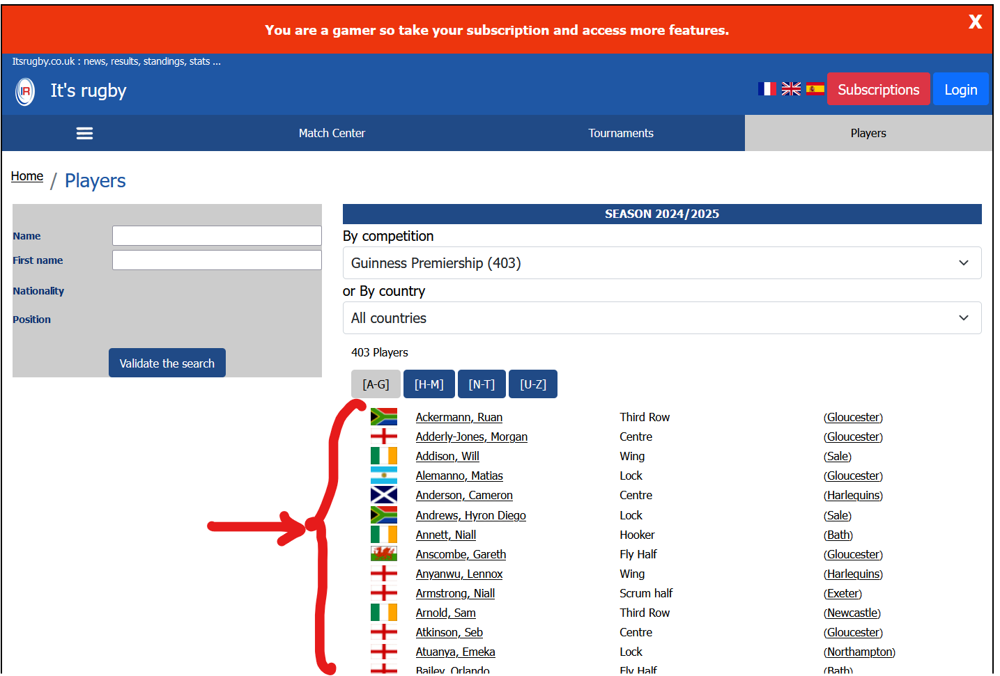
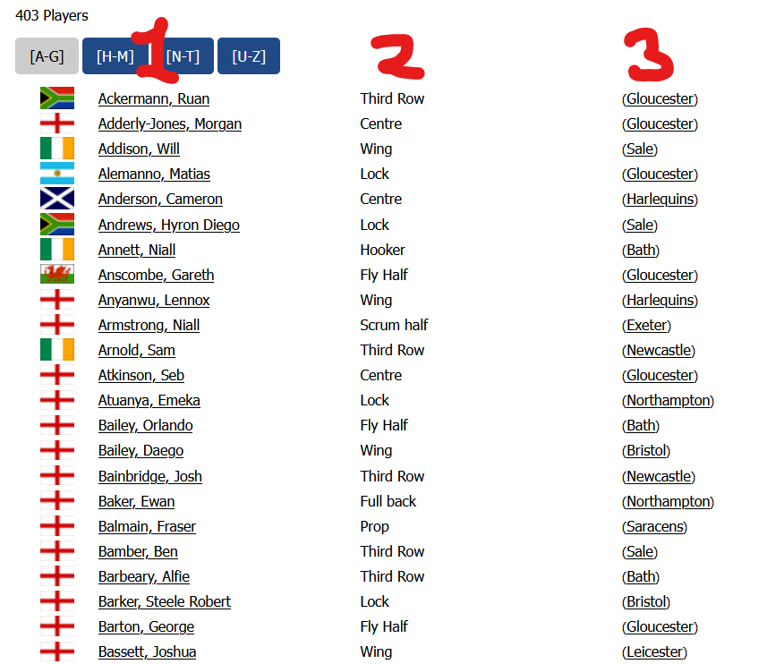

# Занятие 13: Домашнее задание. Разбор домашнего задания

Сайт: https://www.itsrugby.co.uk/playersearch.html

Необходимо получить список всех игроков рэгби и рассортировать их по разным файлам с расширением `csv` в зависимости от страны их происхождения. Пример имени файла для стран Чили и Англия: `players_chile.csv`, `players_england.csv`.

Результирующие таблицы должны содержать следующие колонки:
name (1 на скриншоте), position (2), team (3), country

Note! На странице есть пагинация (не все результаты отображаются сращзу), поэтому убедитесть что получен полный список игроков