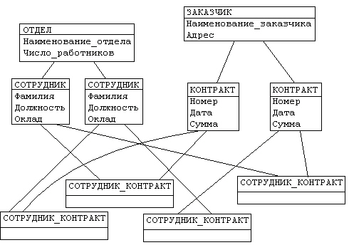
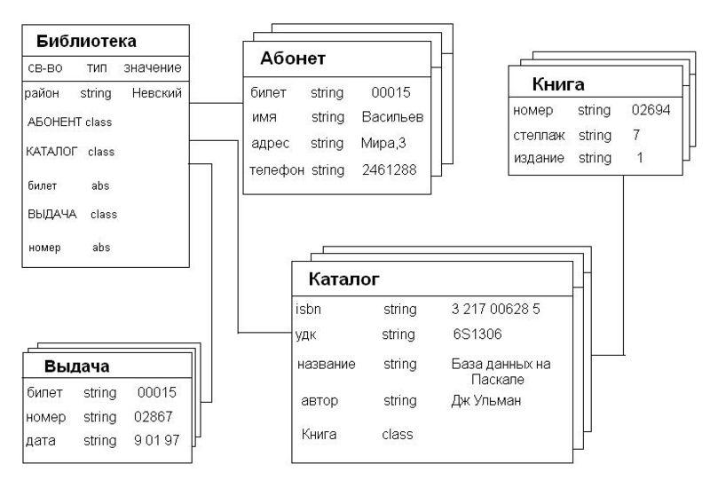

# Занятие 3: Проектирование БД

## 1. Введение в проектирование БД

### Цели проектирования БД

Проектирование баз данных (БД) начинается с определения его целей. Главные цели включают в себя: 
- обеспечение эффективного хранения данных, 
- обеспечение доступности информации для пользователей 
- обеспечение безопасности данных от несанкционированного доступа и потерь. 

**Эффективное хранение** данных подразумевает оптимизацию использования пространства, что позволяет уменьшить затраты на хранение и улучшить производительность системы. **Доступность данных**, в свою очередь, означает, что пользователи смогут быстро и удобно находить нужную информацию, что критично для принятия бизнес-решений. **Безопасность данных** важна для защиты конфиденциальной информации и предотвращения её утечки, что в свою очередь повышает доверие пользователей и клиентов к системе.

### Задачи проектирования БД

Задачи, стоящие перед проектировщиками БД, связаны с различными аспектами работы с данными. 

Во-первых, необходимо определить требования к данным и их структуре, что включает в себя анализ бизнес-процессов и потребностей пользователей. 

Во-вторых, важной задачей является разработка схемы данных, которая учитывает все взаимосвязи между сущностями и атрибутами. Это помогает избежать дублирования информации и повысить целостность данных. 

Наконец, проектировщики должны выбрать подходящие модели и технологии для реализации БД, что может включать выбор между реляционными и нереляционными СУБД в зависимости от требований проекта.

### Этапы проектирования БД

Процесс проектирования БД можно разбить на несколько ключевых этапов. 

Первый этап — сбор требований, на основе которого происходит **анализ потребностей пользователей** и функциональности системы. 

Затем следует концептуальное проектирование, где **определяются сущности, их атрибуты и взаимосвязи**. В этом этапе создается ER-диаграмма, которая визуализирует структуру данных. 

**ER-диаграмма**  

Далее идет **логическое проектирование**, в ходе которого концептуальная модель переводится в логическую структуру БД и происходит нормализация данных. 

На **этапе физического проектирования** определяются структура хранения данных и выбор системы управления базами данных (СУБД), а также оптимизируются параметры производительности. 

После этого осуществляется реализация, включающая **создание БД и заполнение её** данными. Завершает процесс тестирование и внедрение, на котором проверяется работоспособность системы и обучаются пользователи.

## 2. Модели данных

### Введение в модели данных

Модели данных — это абстрактные представления, которые определяют структуру и организацию данных в системе. Они позволяют разработчикам и аналитикам описывать, как данные будут храниться, управляться и манипулироваться. Каждая модель данных имеет свои уникальные характеристики, подходы к организации данных и методы взаимодействия с ними. Понимание различных моделей данных критически важно для выбора наиболее подходящей для конкретной задачи.

### 2.1. Иерархическая модель

Иерархическая модель данных основана на древовидной структуре, где данные организованы в виде узлов. Каждый узел (или запись) может иметь несколько подузлов, но каждый подузел может иметь только одного родителя. Это обеспечивает четкую иерархию и структурированность, что упрощает навигацию по данным.

**Преимущества и недостатки:** 
Такой подход делает доступ к данным быстрым и эффективным, особенно для операций поиска по иерархии. Однако иерархическая модель имеет свои ограничения. Она не позволяет легко осуществлять сложные запросы, которые требуют данных из нескольких узлов, и часто приводит к дублированию информации.

### 2.2. Сетевая модель

Сетевая модель данных является более гибкой и сложной, чем иерархическая. В этой модели данные организованы в виде графа, где каждый узел может иметь множество родительских и дочерних узлов. Это позволяет устанавливать более сложные взаимосвязи между данными.

**Преимущества и недостатки:**
Сетевая модель обеспечивает большую гибкость и более сложные связи между данными, что делает её более подходящей для сложных систем. Тем не менее, сложность структуры и возможность избыточности данных могут затруднять проектирование и управление такой моделью.

### 2.3. Реляционная модель

Реляционная модель данных, разработанная Эдгаром Ф. Коддом, является одной из самых распространенных моделей в настоящее время. Она основывается на использовании таблиц для организации данных, где каждая таблица содержит строки и столбцы. Строки представляют записи, а столбцы — атрибуты этих записей.

**Преимущества:**
Реляционная модель предлагает высокую степень абстракции, что позволяет разработчикам легко управлять данными с помощью SQL (Structured Query Language). Она обеспечивает целостность данных, поддержку транзакций и возможность выполнения сложных запросов с использованием связей между таблицами.

**Недостатки:**
Несмотря на свои преимущества, реляционная модель может иметь ограничения в обработке неструктурированных данных и производительности при работе с большими объемами информации.

### 2.4. Объектно-ориентированная модель

Объектно-ориентированная модель данных расширяет реляционную модель, интегрируя концепции объектно-ориентированного программирования. В этой модели данные хранятся в виде объектов, которые включают как атрибуты, так и методы для обработки этих данных.

**Преимущества:**
Объектно-ориентированная модель предоставляет более естественный способ работы с данными, особенно для приложений, требующих сложных объектов и взаимосвязей. Она позволяет легко моделировать реальные миры и сложные структуры.

**Недостатки:**
Однако, этот подход может требовать больше ресурсов для разработки и управления, а также может быть менее понятным для разработчиков, знакомых только с реляционными моделями.

## 3. Концептуальное проектирование

### Введение в концептуальное проектирование

Концептуальное проектирование — это первый шаг в процессе проектирования базы данных, на котором создается абстрактная модель, описывающая, как различные данные будут структурированы и как они взаимодействуют друг с другом. Этот этап позволяет установить четкое понимание предметной области и требований к данным, прежде чем переходить к более детализированным этапам проектирования.

### 3.1. Определение предметной области

На начальном этапе концептуального проектирования важно провести анализ предметной области, которая будет охватываться базой данных. Это включает в себя изучение процессов, пользователей и данных, которые необходимо хранить и обрабатывать. Важно понять:

- **Ключевые сущности:** Кто или что является основным объектом интереса (например, клиенты, заказы, продукты).
- **Атрибуты сущностей:** Какие характеристики и свойства важны для каждой сущности (например, имя клиента, цена товара, дата заказа).
- **Взаимосвязи между сущностями:** Как различные сущности взаимодействуют друг с другом и какие связи между ними существуют (например, один клиент может делать множество заказов).

### 3.2. Сбор и анализ требований

После определения предметной области необходимо собрать и проанализировать требования от заинтересованных сторон. Это включает в себя:

- **Интервью и опросы:** Общение с заказчиком и заинтересованными сторонами для выявления их потребностей и ожиданий от системы.
- **Определение функциональных и нефункциональных требований:** Функциональные требования описывают, что система должна делать, а нефункциональные требования касаются производительности, безопасности и других аспектов.

### 3.3. Создание ER-диаграммы

На основе собранной информации создается ER-диаграмма (диаграмма "сущность-связь"), которая визуализирует структуру базы данных. ER-диаграмма включает в себя:

- **Сущности:** Прямоугольники, представляющие объекты интереса (например, "Клиент", "Заказ").
- **Атрибуты:** Описание сущности, представляющие характеристики (например, "Имя", "Дата заказа").
- **Связи:** Соединительные линии, показывающие, как сущности взаимосвязаны (например, связь one-to-many или many-to-many).

Создание ER-диаграммы позволяет легко визуализировать структуру базы данных и служит основой для последующих этапов проектирования. Эта диаграмма помогает команде разработчиков, аналитиков и других заинтересованных сторон лучше понять архитектуру данных.

### 3.4. Утверждение модели

После создания ER-диаграммы модель необходимо обсудить и утвердить с заинтересованными сторонами. Это важно для:

- **Получения обратной связи:** Участники процесса могут внести свои предложения и изменения, что поможет улучшить модель.
- **Обеспечения соответствия требованиям:** Утверждение модели гарантирует, что она соответствует всем функциональным и нефункциональным требованиям, собранным на предыдущих этапах.

## 4. Логическое проектирование

### Введение в логическое проектирование

Логическое проектирование — это этап, который следует за концептуальным проектированием и заключается в преобразовании концептуальной модели данных (обычно представленной в виде ER-диаграммы) в логическую структуру базы данных. На этом этапе определяются таблицы, поля и связи между ними, а также осуществляется нормализация данных для обеспечения их целостности и минимизации избыточности.

### 4.1. Определение ключей и индексов

На этапе логического проектирования важно определить ключи и индексы:

- **Первичные ключи:** Это уникальные идентификаторы для каждой записи в таблице. Они обеспечивают уникальность и служат основой для установления связей между таблицами.

- **Внешние ключи:** Используются для установления отношений между таблицами. Внешний ключ в одной таблице ссылается на первичный ключ в другой таблице, что позволяет обеспечить целостность ссылок и поддерживать взаимосвязи.

- **Индексы:** Индексы создаются для ускорения операций поиска и сортировки данных. Они позволяют значительно повысить производительность запросов, особенно в больших таблицах. Однако чрезмерное использование индексов может негативно сказаться на производительности операций вставки и обновления.

### 4.2. Нормализация данных

Нормализация — это процесс организации данных в базе данных с целью уменьшения избыточности и повышения целостности. Она включает в себя несколько нормальных форм (НФ), каждая из которых имеет свои правила.

- **Первая нормальная форма (1НФ):** Обеспечивает, что все значения в столбцах таблицы являются неделимыми. Это означает, что каждый столбец должен содержать только одно значение, а не набор значений.
  
- **Вторая нормальная форма (2НФ):** Достигается, когда таблица находится в 1НФ и все неключевые атрибуты зависят от всего первичного ключа, а не от его части. Это критично для таблиц, у которых первичный ключ состоит из нескольких атрибутов (составной ключ).

- **Третья нормальная форма (3НФ):** Достигается, когда таблица находится во 2НФ и нет транзитивных зависимостей между атрибутами. 
В таблице не должно быть зависимостей, при которых один неключевой атрибут зависит от другого неключевого атрибута. Это означает, что все неключевые атрибуты должны напрямую зависеть только от первичного ключа.

  **Пример**

  Рассмотрим следующую таблицу, представляющую информацию о заказах:

  | ЗаказID | КлиентID | ИмяКлиента | ГородКлиента | Продукт | Количество |
  |---------|----------|-------------|---------------|---------|------------|
  | 1       | 101      | Иван        | Москва        | Товар А | 2          |
  | 2       | 102      | Мария       | Санкт-Петербург| Товар B | 1          |
  | 3       | 101      | Иван        | Москва        | Товар C | 5          |

  В этой таблице наблюдается транзитивная зависимость: "ГородКлиента" зависит от "КлиентID", а не от "ЗаказID". Это значит, что изменение города для клиента требует обновления нескольких строк, что увеличивает риск ошибок и несоответствий.

  Процесс нормализации помогает обеспечить целостность данных, упростить их управление и облегчить изменения в структуре базы данных.

### 4.3. Разработка логической схемы БД

На этом этапе создается логическая схема базы данных, которая представляет собой детализированное описание всех таблиц, полей, типов данных и взаимосвязей. Логическая схема включает в себя:

- **Таблицы:** Каждая таблица описывается с указанием её названия, атрибутов и типов данных.
  
- **Связи:** Указываются типы связей между таблицами, такие как один-к-одному, один-ко-многим или многие-ко-многим.

- **Атрибуты:** Для каждого атрибута указывается его имя, тип данных и ограничения (например, обязательность, уникальность).

## 5. Физическое проектирование

Физическое проектирование — это последний этап проектирования базы данных, на котором логическая модель данных переводится в конкретные структуры, которые будут использованы в реальной системе управления базами данных (СУБД). На этом этапе разрабатываются детали, связанные с хранением данных, выбором индексов, распределением ресурсов и оптимизацией производительности.

### 5.1. Определение структуры хранения данных

Физическое проектирование начинается с определения, как именно данные будут храниться на диске. Это включает:

- **Выбор типов данных:** На этом этапе необходимо выбрать подходящие типы данных для каждого поля в таблицах. Например, для хранения дат можно использовать тип данных "DATE", а для строк — "VARCHAR" с заданной максимальной длиной. Правильный выбор типов данных помогает оптимизировать использование пространства и улучшить производительность.

- **Разработка таблиц:** Создаются конкретные таблицы на основе логической схемы. Важно учитывать, как данные будут разбиваться на страницы (блоки), так как это влияет на эффективность чтения и записи данных.

### 5.2. Индексация данных

Индексация — это один из ключевых аспектов физического проектирования, который значительно влияет на производительность базы данных. Индексы позволяют ускорить выполнение запросов, но могут замедлить операции вставки и обновления. На этом этапе важно:

- **Определить, какие поля индексировать:** Обычно индексируют поля, которые часто используются в условиях поиска или объединения таблиц. Например, если запросы часто ищут данные по полю "КлиентID", то имеет смысл создать индекс на этом поле.

- **Выбор типа индекса:** Существует несколько типов индексов, таких как B-tree, хэш-индексы и полнотекстовые индексы. Выбор типа индекса зависит от специфики запросов, которые будут выполняться.

### 5.3. Оптимизация производительности

На этом этапе проектировщики должны рассмотреть, как можно улучшить производительность базы данных. Это включает:

- **Настройка параметров СУБД:** Важно оптимизировать настройки сервера, такие как размеры буферов, кэширования и другие параметры, чтобы достичь максимальной производительности.

- **Разделение данных:** Если база данных содержит большие объемы информации, может быть целесообразно использовать партиционирование. Это означает разделение таблиц на более мелкие, управляемые части, что упрощает обработку и улучшает производительность.

### 5.4. Безопасность и управление доступом

Физическое проектирование также включает в себя разработку стратегий безопасности и управления доступом:

- **Определение ролей и прав пользователей:** Необходимо определить, кто будет иметь доступ к данным и какие действия они смогут выполнять (чтение, запись, удаление). Это важно для защиты конфиденциальной информации.

- **Шифрование данных:** Если база данных содержит чувствительные данные, такие как личные данные клиентов, важно реализовать шифрование, чтобы защитить информацию от несанкционированного доступа.

### 5.5. Документация

Документация — важный аспект физического проектирования, который часто забывают. Включает в себя:

- **Создание технической документации:** Это включает описание структуры базы данных, типов данных, индексов, правил безопасности и других важных аспектов, которые помогут команде разработчиков в будущем.

- **Разработка руководств для пользователей:** Если база данных будет использоваться другими пользователями или разработчиками, полезно создать руководства, объясняющие, как эффективно работать с системой.

## 6. Реализация БД

### Введение в реализацию БД

Реализация базы данных — это процесс, в ходе которого созданная ранее логическая и физическая модель данных превращается в функционирующую базу данных в выбранной системе управления базами данных (СУБД). Этот этап включает в себя создание структур базы данных, загрузку данных, настройку средств управления и тестирование системы. Реализация — это ключевой момент, где проект становится реальным, и его эффективность будет оцениваться в дальнейшей эксплуатации.

### 6.1. Создание базы данных

Первым шагом в реализации является создание самой базы данных в СУБД. Это включает:

- **Инициализация базы данных:** Используя команды SQL, создается новая база данных. Это может быть сделано через графический интерфейс или командную строку, в зависимости от СУБД.

- **Создание таблиц и определение структур:** На основе физической модели создаются таблицы с указанными полями, типами данных и ограничениями. Например, создаются таблицы для клиентов, заказов и продуктов с соответствующими атрибутами.

### 6.2. Загрузка данных

После создания структуры базы данных необходимо загрузить в нее данные. Этот процесс может включать:

- **Импорт данных:** Если данные уже существуют в другом формате (например, в CSV или Excel), их можно импортировать в базу данных с использованием встроенных средств или специальных скриптов. Это позволяет быстро заполнить таблицы необходимой информацией.

- **Ввод данных вручную:** В некоторых случаях данные могут быть введены вручную через интерфейс приложения или инструменты администрирования базы данных.

### 6.3. Настройка индексов и ограничений

После загрузки данных важно настроить индексы и ограничения для оптимизации работы с базой данных:

- **Создание индексов:** На основе анализа запросов, которые будут выполняться в системе, создаются индексы для повышения производительности. Индексы значительно ускоряют операции поиска, особенно в больших таблицах.

- **Установка ограничений:** Ограничения, такие как уникальные ключи, внешние ключи и проверки, помогают поддерживать целостность данных. Например, внешние ключи обеспечивают соответствие между связанными таблицами и предотвращают вставку несуществующих записей.

### 6.4. Разработка интерфейсов и приложений

На этапе реализации также разрабатываются интерфейсы, через которые пользователи будут взаимодействовать с базой данных:

- **Создание пользовательских интерфейсов:** Разработка веб-приложений или настольных приложений, через которые пользователи смогут вводить, редактировать и просматривать данные. Это может включать формы для ввода информации, отчеты и панели управления.

- **Использование API:** Если база данных должна интегрироваться с другими системами, разрабатываются API (интерфейсы программирования приложений), которые позволяют взаимодействовать с данными через стандартизированные запросы.

### 6.5. Тестирование базы данных

Тестирование является критически важным этапом реализации, так как оно позволяет выявить и устранить потенциальные проблемы:

- **Функциональное тестирование:** Проверка, что все функции и операции базы данных работают корректно. Это включает в себя вставку, обновление, удаление и выборку данных.

- **Производительное тестирование:** Оценка производительности базы данных под нагрузкой, чтобы убедиться, что она способна обрабатывать ожидаемые объемы запросов без значительных задержек.

- **Тестирование безопасности:** Проверка механизмов безопасности и управления доступом, чтобы убедиться, что данные защищены от несанкционированного доступа.

### 6.6. Документация

На этапе реализации также важно создать полную документацию:

- **Техническая документация:** Описание структуры базы данных, схем, индексов, ограничений и интерфейсов. Это важно для будущих разработчиков и администраторов базы данных.

- **Пользовательская документация:** Руководства и инструкции для конечных пользователей, объясняющие, как взаимодействовать с приложением и использовать базу данных.

