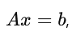

# Занятие 3: Универсальные функции. Работа с матрицами и векторами

## 1. Универсальные функции (ufunc)

### Определение и функции ufunc

Универсальные функции, или ufunc (от "universal functions"), представляют собой функции в библиотеке NumPy, которые позволяют выполнять операции над массивами. Эти функции обеспечивают эффективное выполнение операций элемент-wise, что означает, что они могут обрабатывать каждый элемент массива независимо от других.

Универсальные функции обрабатывают данные в векторизованной форме, что существенно ускоряет выполнение операций по сравнению с обычными циклами в Python. Они могут применяться к одномерным и многомерным массивам, что делает их универсальным инструментом для работы с данными.

### Преимущества использования ufunc: скорость и векторизация

Одним из основных преимуществ ufunc является их высокая производительность. Благодаря векторизации, операции выполняются на уровне массивов, что позволяет избежать затрат времени на итерацию по элементам с помощью циклов. 

- **Скорость**: ufunc написаны на C, что делает их намного быстрее, чем эквивалентные операции, реализованные на Python. Например, выполнение операции сложения двух больших массивов с использованием ufunc займет значительно меньше времени, чем если бы мы использовали цикл `for`.

- **Векторизация**: Вместо того чтобы обрабатывать каждый элемент массива по отдельности, ufunc применяются к всему массиву сразу. Это упрощает код, делает его более читаемым и уменьшает вероятность ошибок.

### Примеры базовых ufunc: `np.add`, `np.subtract`, `np.multiply`, `np.divide`

NumPy предоставляет несколько базовых ufunc для выполнения арифметических операций. Рассмотрим их на примерах:

1. **`np.add`**: Эта функция выполняет сложение двух массивов. Например:
   ```python
   import numpy as np
   
   a = np.array([1, 2, 3])
   b = np.array([4, 5, 6])
   result = np.add(a, b)
   print(result)  # Вывод: [5 7 9]
   ```
   В данном случае `np.add` сложил элементы массивов `a` и `b` поэлементно.

2. **`np.subtract`**: Эта функция выполняет вычитание одного массива из другого.
   ```python
   result = np.subtract(a, b)
   print(result)  # Вывод: [-3 -3 -3]
   ```
   Здесь каждый элемент массива `b` был вычтен из соответствующего элемента массива `a`.

3. **`np.multiply`**: Эта функция выполняет умножение двух массивов.
   ```python
   result = np.multiply(a, b)
   print(result)  # Вывод: [ 4 10 18]
   ```
   Каждый элемент `a` был умножен на соответствующий элемент `b`.

4. **`np.divide`**: Эта функция выполняет деление одного массива на другой.
   ```python
   result = np.divide(a, b)
   print(result)  # Вывод: [0.25 0.4  0.5 ]
   ```
   В этом примере каждый элемент `a` был разделен на соответствующий элемент `b`.

Вот список дополнительных универсальных функций (ufunc) в NumPy, которые могут быть полезны при работе с массивами:

### Тригонометрические функции
- **`np.sin`**: вычисляет синус.
  ```python
  angles = np.array([0, np.pi/2, np.pi])
  result = np.sin(angles)  # Вывод: [0. 1. 0.]
  ```

- **`np.cos`**: вычисляет косинус.
  ```python
  result = np.cos(angles)  # Вывод: [ 1. 0. -1.]
  ```

- **`np.tan`**: вычисляет тангенс.
  ```python
  result = np.tan(angles)  # Вывод: [0. 1. 0.]
  ```

### Гиперболические функции
- **`np.sinh`**: вычисляет гиперболический синус.
- **`np.cosh`**: вычисляет гиперболический косинус.
- **`np.tanh`**: вычисляет гиперболический тангенс.

### Экспоненциальные и логарифмические функции
- **`np.exp`**: вычисляет экспоненту.
  ```python
  result = np.exp(a)  # e^a для каждого элемента массива a
  ```

- **`np.log`**: вычисляет натуральный логарифм.
  ```python
  result = np.log(a)  # Вывод: [0. 0.6931 1.0986] для a=[1, 2, 3]
  ```

- **`np.log10`**: вычисляет десятичный логарифм.
  
### Степенные функции
- **`np.power`**: возводит элементы массива в степень.
  ```python
  result = np.power(a, 2)  # Возведение в квадрат каждого элемента a
  ```

- **`np.sqrt`**: вычисляет квадратный корень.
  ```python
  result = np.sqrt(a)  # Квадратный корень каждого элемента
  ```

### Сложные функции
- **`np.abs`**: вычисляет модуль (абсолютное значение).
  ```python
  result = np.abs(np.array([-1, -2, 3]))  # Вывод: [1 2 3]
  ```

- **`np.ceil`**: округляет вверх.
  
- **`np.floor`**: округляет вниз.
  
- **`np.round`**: округляет до ближайшего целого.

## 2. Арифметические операции с векторами

Арифметические операции с векторами (или одномерными массивами) в NumPy являются основой для выполнения математических расчетов и анализа данных. Эти операции могут быть выполнены над двумя массивами одинаковой длины или с использованием механизма broadcasting.

### Примеры операций с одномерными массивами

```python
a = np.array([10, 20, 30])
b = np.array([1, 2, 3])

# Сложение
sum_result = a + b  # Вывод: [11, 22, 33]

# Вычитание
sub_result = a - b  # Вывод: [9, 18, 27]

# Умножение
mul_result = a * b  # Вывод: [10, 40, 90]

# Деление
div_result = a / b  # Вывод: [10, 10, 10]
```

Каждая из операций выполняется поэлементно, и результаты сохраняются в новых переменных.

### Broadcasting: правила и примеры

Broadcasting — это мощная концепция в NumPy, позволяющая выполнять операции с массивами различной размерности. Когда размеры массивов не совпадают, NumPy автоматически расширяет (или "broadcasts") меньший массив, чтобы он соответствовал размеру большего массива. Это позволяет избежать необходимости вручную изменять размер массивов перед выполнением операций.

#### Правила broadcasting

1. **Если массивы имеют разные размеры**:
   - Если размеры массивов различаются, то массив с меньшей размерностью будет расширен так, чтобы соответствовать массиву с большей размерностью.

2. **Если размеры вдоль определенной оси совпадают** или один из массивов имеет размер 1, то они могут быть совместимы.

3. **Если размеры не совпадают** и ни один из массивов не имеет размер 1, то возникает ошибка.

Конечно! Вот три примера, иллюстрирующих правила broadcasting в NumPy.

### Пример 1: Совпадающие размеры

```python
import numpy as np

# Массив 1 (размер: (2, 3))
a = np.array([[1, 2, 3], 
              [4, 5, 6]])

# Массив 2 (размер: (3,))
b = np.array([10, 20, 30])

# Broadcasting
result = a + b
print(result)
```

**Результат:**
```
[[11 22 33]
 [14 25 36]]
```

В этом случае массив `b` был "развёрнут" по строкам массива `a`, и операция сложения была выполнена поэлементно.

---

### Пример 2: Ошибка из-за несовпадающих размеров

```python
# Массив 1 (размер: (2, 3))
c = np.array([[1, 2, 3], 
              [4, 5, 6]])

# Массив 2 (размер: (2, 2))
d = np.array([[10, 20], 
              [30, 40]])

# Попытка сложения
try:
    result = c + d
except ValueError as e:
    print("Ошибка:", e)
```

**Вывод:**
```
Ошибка: operands could not be broadcast together with shapes (2,3) (2,2) 
```

В этом случае массивы имеют несовпадающие размеры по второй оси, что приводит к ошибке.

---

### Пример 3: Использование размерности 1

```python
# Массив 1 (размер: (3,))
e = np.array([1, 2, 3])

# Массив 2 (размер: (2, 1))
f = np.array([[10], 
              [20]])

# Сложение
result = e + f
```

**Вывод:**
```
[[11 12 13]
 [21 22 23]]
```

## 3. Транспонирование матриц

### Введение

Транспонирование матриц — это важная операция в линейной алгебре и численных вычислениях, которая используется во многих областях, таких как физика, статистика, машинное обучение и научные вычисления. В NumPy операция транспонирования позволяет менять местами строки и столбцы матрицы, превращая строки в столбцы и наоборот.

### Определение транспонирования

Транспонирование матрицы обозначается символом  A^T  для матрицы  A . Если матрица  A  имеет размер  m*n  (где  m  — количество строк, а  n  — количество столбцов), то её транспонированная матрица  A^T  будет иметь размер  n*m .

#### Пример

Рассмотрим матрицу  A :


Транспонированная матрица  A^T  будет:


### В NumPy: как выполнить транспонирование

В библиотеке NumPy операция транспонирования может быть выполнена несколькими способами:

1. **Использование метода `.T`**:
   Этот метод позволяет получить транспонированную матрицу просто и удобно.
   ```python
   import numpy as np

   A = np.array([[1, 2, 3],
                 [4, 5, 6]])
   A_T = A.T
   print(A_T)
   ```
   **Вывод:**
   ```
   [[1 4]
    [2 5]
    [3 6]]
   ```

2. **Использование функции `np.transpose`**:
   Эта функция выполняет ту же операцию и может быть использована, если нужно явно указать, что мы хотим транспонировать массив.
   ```python
   A_T = np.transpose(A)
   print(A_T)
   ```
   **Вывод будет тем же, что и в предыдущем примере.**

3. **Использование функции `np.swapaxes`**:
   Эта функция позволяет менять местами заданные оси массива. Например, чтобы транспонировать матрицу, мы можем поменять местами оси 0 и 1.
   ```python
   A_T = np.swapaxes(A, 0, 1)
   print(A_T)
   ```
   **Вывод также будет:**
   ```
   [[1 4]
    [2 5]
    [3 6]]
   ```

## 4. Матричное умножение

### Введение

Матричное умножение — это одна из ключевых операций в линейной алгебре, которая находит широкое применение в математике, физике, статистике и машинном обучении. В отличие от поэлементного умножения, матричное умножение основано на определенных правилах и имеет свои особенности. В этой части мы рассмотрим определение, правила матричного умножения и способы его выполнения в NumPy.

### Определение и правила матричного умножения

**Определение**:
Матричное умножение — это операция, которая позволяет получать новую матрицу (результат), умножая строки первой матрицы на столбцы второй матрицы. Если у вас есть матрица  A  размером  m*n  и матрица  B  размером  n*p , то их произведение  C = A*B  будет матрицей размером  m*p .

#### Правила матричного умножения:

1. **Совпадение размерностей**:
   - Для умножения матриц количество столбцов первой матрицы должно совпадать с количеством строк второй матрицы.
   - Если  A  имеет размерность  (m*n)  и  B  имеет размерность  (n*p) , то результат  C  будет иметь размерность  (m*p) .

2. **Сложение произведений**:
   - Каждый элемент  C[i, j]  результирующей матрицы вычисляется как сумма произведений элементов строки  i  матрицы  A  и столбца  j  матрицы  B :


### Использование `np.dot` и оператора `@`

В NumPy для выполнения матричного умножения можно использовать:

1. **Функцию `np.dot`**:
   Эта функция предназначена для выполнения различных операций умножения, включая матричное умножение. Однако стоит отметить, что для одномерных массивов `np.dot` возвращает скалярное произведение.

   ```python
   import numpy as np

   A = np.array([[1, 2], 
                 [3, 4]])
   B = np.array([[5, 6], 
                 [7, 8]])
   C = np.dot(A, B)
   print(C)
   ```

   **Вывод:**
   ```
   [[19 22]
    [43 50]]
   ```

2. **Оператор `@`**:
   С введением Python 3.5 был добавлен оператор `@`, который позволяет использовать более понятный синтаксис для матричного умножения.

   ```python
   C = A @ B
   print(C)
   ```

   **Результат будет таким же, как и с использованием `np.dot`.**

### Примеры матричного умножения и его применение

#### Пример 1: Простое матричное умножение

Рассмотрим два примера матриц:

```python
A = np.array([[1, 2, 3], 
              [4, 5, 6]])  # Размер: (2, 3)

B = np.array([[7, 8], 
              [9, 10], 
              [11, 12]])  # Размер: (3, 2)

C = A @ B  # или np.dot(A, B)
print(C)
```

**Вывод:**
```
[[ 58  64]
 [139 154]]
```

Здесь мы перемножили матрицы  A  и  B , чтобы получить результирующую матрицу  C  размером  (2, 2) .

#### Пример 2: Применение в реальных задачах

Матричное умножение находит применение в различных задачах, например, в машинном обучении для вычисления прогнозов.

```python
# Пример весов и входных данных
weights = np.array([[0.2, 0.8], 
                    [0.6, 0.4]])  # Размер: (2, 2)

inputs = np.array([[1], 
                   [2]])  # Размер: (2, 1)

# Вычисление выхода
output = weights @ inputs
print(output)
```

**Вывод:**
```
[[1.8]
 [1.4]]
```

В этом примере матричное умножение используется для вычисления выходного значения нейронной сети на основе весов и входных данных.

#### Пример 3: Матричное умножение и преобразования

Матричное умножение также используется для выполнения линейных преобразований, например, при изменении координат в пространстве.

```python
# Определение точки
point = np.array([[1], 
                  [2]])  # Размер: (2, 1)

# Определение матрицы преобразования (например, поворот)
transformation_matrix = np.array([[0, -1], 
                                   [1, 0]])  # 90 градусов против часовой стрелки

# Применение преобразования
new_point = transformation_matrix @ point
print(new_point)
```

**Вывод:**
```
[[-2]
 [ 1]]
```

В этом примере точка была преобразована с помощью матрицы поворота, и результатом стало новое положение точки.

## 5. Векторизация и оптимизация вычислений с матрицами

Одним из главных преимуществ использования ufunc является векторизация. Это позволяет выполнять операции над массивами без явных циклов, что значительно увеличивает производительность.

#### Векторизация

Векторизация — это процесс преобразования циклов в операции над массивами. Это позволяет NumPy использовать оптимизированные алгоритмы и библиотечные функции, что значительно ускоряет выполнение.

##### Пример: Векторизация в действии

Предположим, что у нас есть задача вычислить квадрат всех элементов матрицы A:

```python
A = np.array([[1, 2, 3], 
              [4, 5, 6]])

# Векторизованное вычисление квадратов
squared = np.square(A)  # Или A ** 2
print(squared)
```

**Вывод:**
```
[[ 1  4  9]
 [16 25 36]]
```

В данном примере используется ufunc `np.square`, которая векторизованно вычисляет квадрат каждого элемента матрицы A.

#### Оптимизация вычислений

Векторизация не только упрощает код, но и делает его более производительным. В NumPy операции с массивами обычно выполняются быстрее, чем аналогичные операции в Python с обычными списками, благодаря тому, что NumPy использует низкоуровневые оптимизации и эффективные алгоритмы.

##### Пример: Сравнение производительности

Для сравнения скорости выполнения векторизированных операций и циклов Python можно провести тест:

```python
import time

# Создание большой матрицы
A = np.random.rand(1000, 1000)

# Векторизация
start_time = time.time()
result_vectorized = np.square(A)
end_time = time.time()
print("Векторизация время:", end_time - start_time)

# Цикл Python
result_loop = np.empty_like(A)
start_time = time.time()
for i in range(A.shape[0]):
    for j in range(A.shape[1]):
        result_loop[i, j] = A[i, j] ** 2
end_time = time.time()
print("Цикл Python время:", end_time - start_time)
```

Обычно вы увидите, что время выполнения векторизированного кода будет значительно меньше, чем в циклах.


## 6. Работа с векторами и матрицами: применение

### Введение

Векторы и матрицы играют ключевую роль в научных вычислениях, обработке данных и машинном обучении. Они используются для представления данных и решения различных математических задач.

### Примеры задач

#### Пример 1: Решение системы линейных уравнений

Системы линейных уравнений можно эффективно решать с использованием матриц. Рассмотрим систему уравнений:


Эта система может быть представлена в виде матричного уравнения  где:


Для решения этой системы в NumPy мы можем использовать функцию `np.linalg.solve`:

```python
import numpy as np

A = np.array([[2, 3],
              [4, 9]])
b = np.array([5, 8])

# Решение системы
solution = np.linalg.solve(A, b)
print("Решение:", solution)
```

**Вывод:**
```
Решение: [1. 1.]
```

В данном примере NumPy позволяет быстро найти значения  x  и  y , удовлетворяющие системе уравнений.

#### Пример 2: Трансформации данных

Векторы и матрицы часто используются для трансформации данных, таких как масштабирование, вращение и сдвиг. Рассмотрим простой случай вращения точек в двумерном пространстве.

Для вращения точки на угол `θ` используется матрица вращения:


Допустим, у нас есть точка  `P = (x, y)` , которую мы хотим повернуть на 90 градусов (или  `pi/2`  радиан):

```python
import numpy as np

# Угол вращения
theta = np.pi / 2  # 90 градусов

# Матрица вращения
R = np.array([[np.cos(theta), -np.sin(theta)],
              [np.sin(theta), np.cos(theta)]])

# Исходная точка
P = np.array([1, 0])

# Применение вращения
P_rotated = R @ P
print("Повернутая точка:", P_rotated)
```

**Вывод:**
```
Повернутая точка: [0. 1.]
```

В результате точка  P  была успешно повернута на 90 градусов, и мы получили новую точку.
