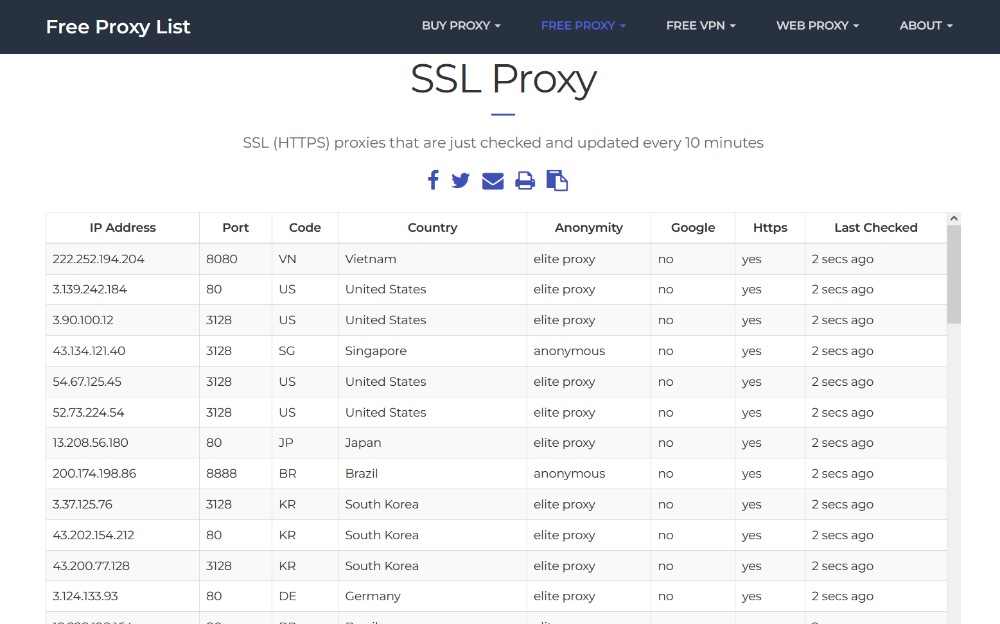

# Занятие 13: Домашнее задание. Разбор домашнего задания

Сайт для парсинга: https://www.sslproxies.org/

### Задание
Создать класс, который получает данные с сайта с прокси, записывает таблицу в DataFrame и после парсинга сохраняет результат в CSV файл.

### Парсинг сайта
На главной странице сайта находится таблица с прокси. Необходимо получить ее в том же виде.
