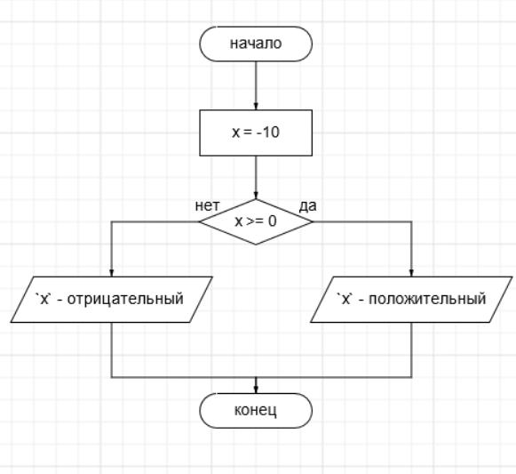
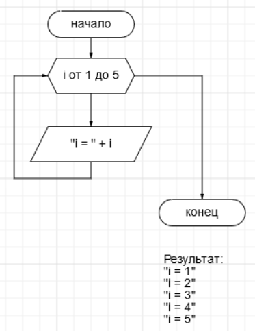
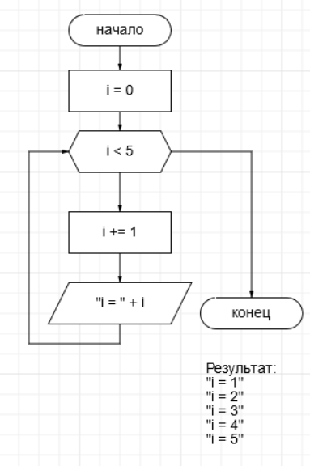
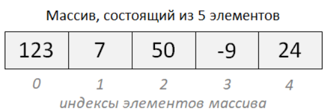
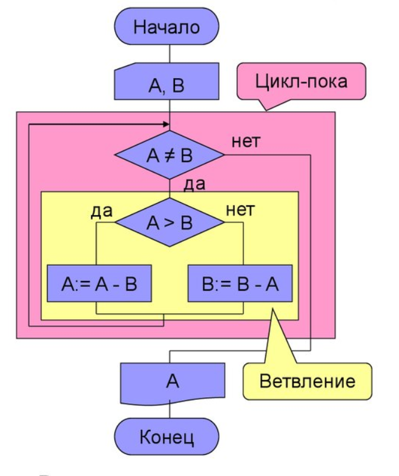
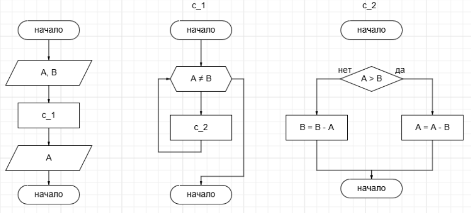
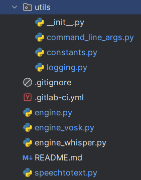
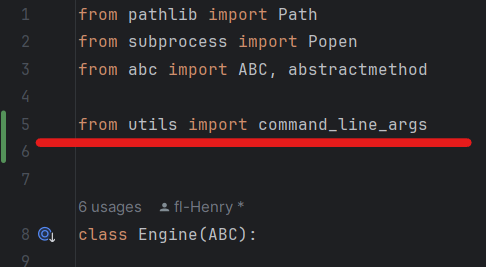

<h2>1. Введение в программирование</h2> 

#### Что такое программирование?

Программирование — это процесс создания и написания инструкций (программ), которые компьютер может выполнить. Оно позволяет автоматизировать задачи, обрабатывать данные, создавать приложения и многое другое.

Программирование включает в себя не только написание кода, но и планирование, тестирование и отладку программных решений.

#### Зачем программирование используется в современном мире?

1. **Автоматизация процессов**: Позволяет сделать многие задачи более эффективными и менее подверженными человеческим ошибкам.
   
2. **Разработка приложений**: Создание программ и приложений для различных платформ — от мобильных устройств до серверов.

3. **Обработка данных**: Анализ и манипулирование большими объемами данных для принятия решений в бизнесе, науке и других областях.

4. **Машинное обучение и искусственный интеллект**: Разработка алгоритмов и моделей для обучения компьютеров с целью выполнения специфических задачь без явного программирования.

5. **Информационная безопасность**: Создание защищенных систем и механизмов для защиты данных и сетей.

#### Примеры областей применения программирования:

- **Веб-разработка**: Создание сайтов и веб-приложений с использованием языков программирования и фреймворков.
  
- **Мобильная и desktop разработка**: Разработка приложений для мобильных устройств (iOS, Android) и компьюикров (Windows, Mac OS, Linux).
  
- **Научные и инженерные вычисления**: Моделирование, анализ данных и решение сложных математических задач.

- **Базы данных и системы управления данными**: Создание и управление базами данных для хранения и обработки информации.

Программирование играет ключевую роль в современном технологическом мире, обеспечивая развитие и инновации в различных отраслях и сферах деятельности.


<h2>2. Основные термины и понятия</h2>

#### Переменные и их типы

1. **Переменная**:
   - Переменная — это символическое имя, которое связывается с некоторым значением или данными в программе. Пример объявления переменной: `x = 5`.
   - Переменные используются для хранения и манипулирования данными в программе.

2. **Типы данных**:
   - **Целочисленные типы (int)**: Целые числа, например, `5`, `-10`.
   - **Вещественные типы (float)**: Числа с плавающей точкой, например, `3.14`, `-0.001`.
   - **Строковый тип (str)**: Последовательность символов, заключенных в кавычки, например, `"Hello, World!"`.
   - **Логический тип (bool)**: Принимает значения `True` или `False`.

#### Операторы и выражения

1. **Операторы**:
   - **Арифметические операторы**: `+` (сложение), `-` (вычитание), `*` (умножение), `/` (деление), `**` (возведение в степень), `%` (остаток от деления).
   - **Логические операторы**: `and` (логическое И), `or` (логическое ИЛИ), `not` (логическое НЕ).
   - **Операторы сравнения**: `==` (равно), `!=` (не равно), `>` (больше), `<` (меньше), `>=` (больше или равно), `<=` (меньше или равно).

2. **Выражения**:
   - Выражение — это комбинация значений переменных и операторов. Каждое выражение имеет результат
   - Примеры выражений: 
        - `x = 3 + 5` (в `x` будет записан результат равный 8)
        - `x > 0` (результат выражения `True`)
        - `"Hello" + " " + "World"` (результат выражения `Hello World`)

#### Условные операторы и логические выражения

1. **Условные операторы**:
   - Конструкция `if-else` используется для выполнения различных блоков кода в зависимости от условия.

2. **Логические выражения**:
   - Логические выражения используются в условных операторах для проверки истинности или ложности условий.
   - Примеры: `x > 0`, `a == b`, `not is_valid`.

   Пример:  

   
     ```python
     x = -10
     if x >= 0:
         print("Число положительное")
     else:
         print("Число отрицательное")
     ```


#### Циклы

1. **Циклы**:
   - Циклы позволяют выполнить один и тот же блок кода несколько раз.
   - **Цикл со счетчиком**: Используется для перебора элементов в последовательности (например, список или строка) или выполнения кода определенное количество раз.  

      
   - **Цикл с условием**: Выполняет блок кода до тех пор, пока условие истинно.

      
     

### Заключение
Основные термины и понятия, такие как переменные, типы данных, операторы и условные конструкции, являются фундаментальными для понимания программирования. Они позволяют программистам создавать и управлять данными, выполнять условные действия и разрабатывать сложные алгоритмы.


<h2>3. Базовые структуры данных</h2>

Структура данных — это контейнер, который хранит данные в определенном формате.


#### Строки и операции над ними

1. **Строки**:
   - Строка представляет собой последовательность символов, заключенных в кавычки (одинарные или двойные).  Примеры строк: `"Hello, World!"`, `'Hello, World!'`.
   - Если в нутри строки встречается символ ковычек или специальный символ, то он должен быть экранирован. Пример: `'My name\'s Henry.\nWhat\s your name?'`
   - Строки могут содержать буквы, цифры, символы и пробелы.

2. **Операции над строками**:
   - **Конкатенация строк**: Объединение строк с помощью оператора `+`.
     ```python
     "Hello" + ", " + "World" + "!"
     # Результат: "Hello, World!"
     ```

   - **Сравнение строк**: Применение логических операторов к строкам.
     ```python
     "Hello" == "World!"
     # Результат: False
     
     "Hello" != "World!"
     # Результат: True
     ```

   - **Индексация и срезы**: Получение отдельных символов или подстрок из строки.
     ```python
     s = "Hello, World!"
     s[0]  
     # Вывод: "H" (символ с индексом 0)

     s[7:12] 
     # Вывод: "World" (срез с 7 по 11 символ)
     ```

   - **Методы строк**: В Python также есть много встроенных методов для работы со строками, такие как `split()`, `strip()`, `replace()`, `upper()`, `lower()` и другие.


#### Массивы

1. **Опредеоение**:
   - Массив (List) — это упорядоченная коллекция элементов, которая может содержать элементы различных типов.
   - Пример списка: `numbers = [1, 2, 3, 4, 5]`, `fruits = ['apple', 'banana', 'cherry']`.
   - Массив также может содержать в себе другие массивы. В этом случае массив становится многомерным.
   ```python
   m = [
      [1, 2, 3],
      [4, 5, 6],
      [7, 8, 9]
   ]
   ```

2. **Основные операции с массивами**:
   
   - **Доступ к элементам по индексу**:
     ```python
     m[0]  
     # Вывод: 123 (элемент с индексом 0)
     ```

   - **Добавление и удаление элементов**:
     Можно добавлять элементы в конец массива или удалять элемент по его индексу.

   - **Срезы**:
     ```python
     m[1:4]  
     # Вывод: [7, 50, -9] (срез с индекса 1 до 3)
     ```

   - **Методы списков**: В Python также есть много встроенных методов для работы с массивами`append()`, `extend()`, `insert()`, `remove()`, `pop()` и другие.

### Заключение
Строки и массивы (списки) являются основными структурами данных в Python, которые позволяют организовывать и хранить данные различных типов. Понимание и умение работать с этими структурами являются важными навыками для программиста, поскольку они широко используются в разработке программ и алгоритмов.


<h2>4. Основные принципы программирования</h2>

#### Процедурное программирование

- Процедурное программирование — это парадигма программирования, в которой программа разбивается на отдельные функции (процедуры), которые выполняют конкретные задачи.
- Процедуры являются независимыми от основной программы блоками кода, которые могут вызываться из различных частей программы.





#### Функции и их роль в организации кода

1. **Функции**:
   - Функция — это блок кода, который выполняет определенную задачу при вызове.
   - Функции позволяют абстрагировать код, делая его более читаемым и поддерживаемым.
   - Основные преимущества использования функций:
     - **Изоляция кода**: Логически связанные операции могут быть организованы в функции.
     - **Повторное использование кода**: Функции могут быть вызваны из различных частей программы без необходимости дублирования кода.
     - **Улучшение структуры программы**: Разделение программы на функции упрощает отладку и модификацию кода.

#### Модули и их использование для организации программы на уровне файлов

1. **Модули**:
   - Модуль в Python — это файл с расширением `.py`, содержащий определения функций, классов, переменных и других компонентов программы.
   - Модули позволяют организовать код на уровне файлов, разделяя его на логические блоки и подмодули.
      
      

      

2. **Преимущества использования модулей**:
   - **Организация кода**: Разделение программы на модули упрощает сопровождение и расширение функциональности.
   - **Изоляция функциональности**: Каждый модуль может содержать свои собственные функции и классы, что облегчает понимание и управление кодом.

### Заключение
Основные принципы программирования, такие как процедурное программирование, использование функций и модулей, являются ключевыми для организации и структурирования кода в Python. Эти концепции способствуют повышению эффективности разработки, улучшению читаемости и поддерживаемости программных проектов.


<h2>5. Обработка исключений</h2>

#### Понятие исключений и их роль в программировании

1. **Исключения**:
   - Исключение — это событие, которое возникает во время выполнения программы и нарушает нормальный поток её выполнения.
   - Исключения возникают при ошибке в коде, например, при делении на ноль (`ZeroDivisionError`), доступе к несуществующему индексу списка (`IndexError`), или при попытке преобразования строки в число (`ValueError`).
   - Роль исключений в программировании заключается в обработке и управлении ошибками, чтобы программы могли гибко реагировать на непредвиденные ситуации.

#### Обработка исключений с помощью конструкции try-except

   - Для обработки исключений в Python используется конструкция `try-except`.
   - В блоке `try` помещается код, который может вызвать исключение.
   - В блоке `except` указывается, какие исключения должны быть обработаны, и как именно программа должна реагировать на них.
   - Пример:
     ```python
     try:
         x = 10 / 0  # Попытка деления на ноль
     except ZeroDivisionError as e:
         print("Ошибка деления на ноль:", e)
     ```

#### Примеры распространенных ошибок и их обработка

   - **Деление на ноль (`ZeroDivisionError`)**:
     ```python
     try:
         result = 10 / 0
     except ZeroDivisionError as e:
         print("Ошибка деления на ноль:", e)
     ```

   - **Индекс за пределами списка (`IndexError`)**:
     ```python
     try:
         numbers = [1, 2, 3]
         print(numbers[10])
     except IndexError as e:
         print("Ошибка индексации списка:", e)
     ```

   - **Преобразование типов данных (`ValueError`)**:
     ```python
     try:
         number = int("abc")
     except ValueError as e:
         print("Ошибка преобразования типа данных:", e)
     ```

### Заключение

Обработка исключений является важной частью программирования, позволяющей предотвратить аварийное завершение программы при возникновении ошибок. Конструкция `try-except` в Python позволяет ловить исключения и выполнять альтернативные действия для обеспечения более надежного и устойчивого выполнения кода. Знание и использование этой конструкции помогает программистам создавать более надежные и обслуживаемые программы.