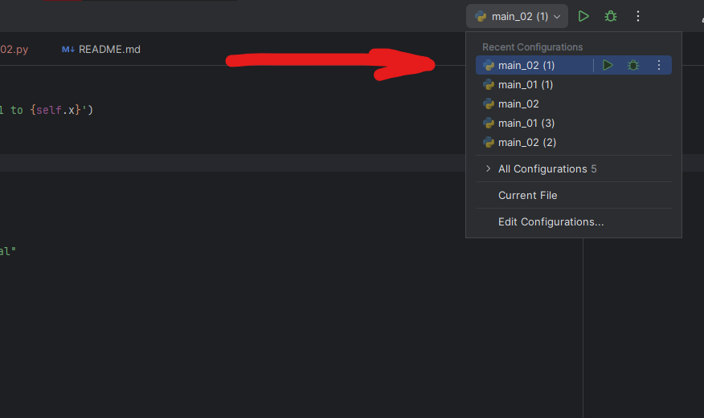
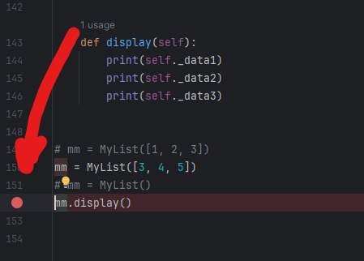
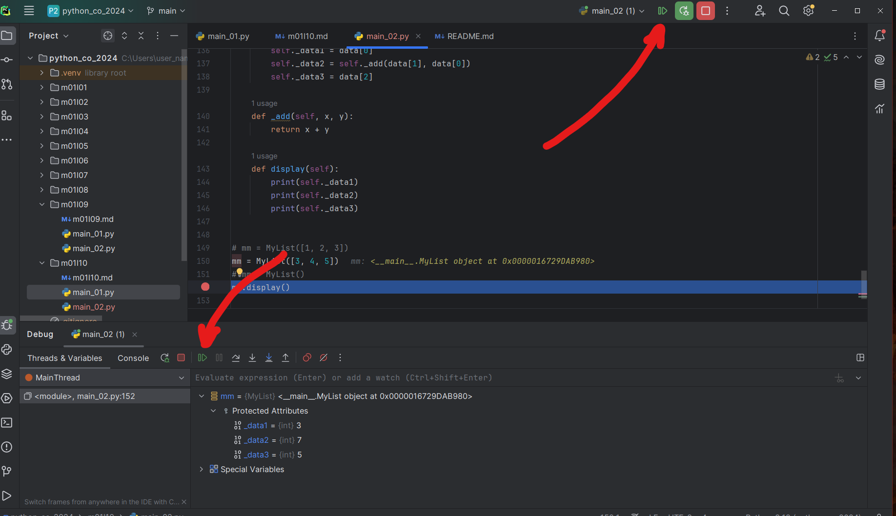
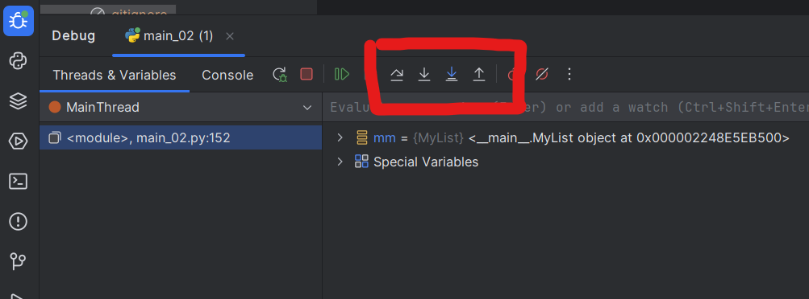
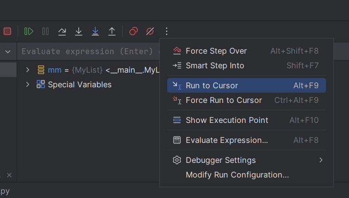
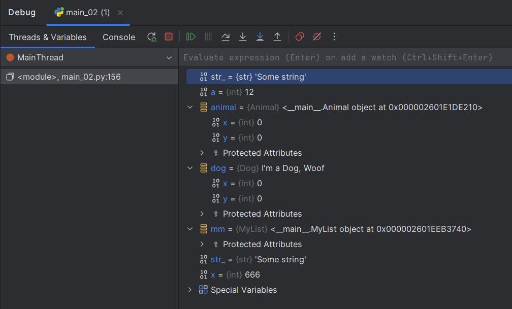
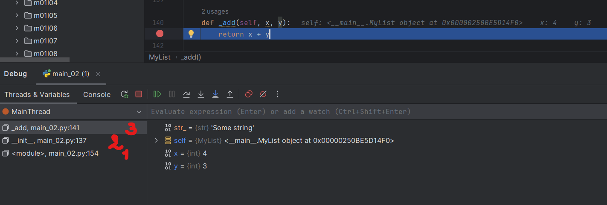

<h2 id="m1l11">Занятие 11: Основы отладки и работы с виртуальным окружением</h2>


## 1. Основы отладки в PyCharm

### Что такое отладка?

**Определение отладки:**
Отладка — это процесс нахождения и устранения ошибок (или "багов") в программном обеспечении. В ходе отладки разработчик анализирует, тестирует и корректирует код, чтобы убедиться, что программа работает правильно.

**Цели и задачи отладки:**
- **Идентификация ошибок:** Определить, где в коде возникает ошибка.
- **Анализ поведения:** Понять, как код выполняется и какие данные используются.
- **Устранение неисправностей:** Исправить ошибки и улучшить функциональность программы.
- **Оптимизация:** Найти и устранить участки кода, которые могут быть неэффективными.

### Основы отладки в PyCharm

**Запуск отладки: как запустить программу в режиме отладки**
- В PyCharm, чтобы запустить программу в режиме отладки, нужно:
  - **Выбрать конфигурацию запуска**: Убедитесь, что выбрана правильная конфигурация запуска (например, `Python`).  
  
  - **Запуск отладки**: Нажмите на зелёную стрелку с жуком (или используйте комбинацию клавиш `Shift + F9`) для запуска программы в режиме отладки.

**Установка точек останова: Как установить и удалить точки останова (breakpoints)**
- **Установка точки останова**:
  - Щелкните в левой полосе кода напротив строки, где вы хотите приостановить выполнение программы. Появится красная точка (breakpoint).  
  
- **Удаление точки останова**:
  - Щелкните на установленной точке останова, чтобы удалить её. Она исчезнет из полосы кода.

**Управление выполнением:**

- **Продолжение выполнения (`Resume Program`)**:
  - Возобновляет выполнение программы после её приостановки на точке останова. Можно использовать кнопку `Resume` в панели отладки (зелёная стрелка с тёмным кругом).  
  

- **Шаг за шагом (`Step Over`, `Step Into`, `Step Out`)**:
  
  - **`Step Over` (F8)**: Выполняет текущую строку кода и переходит к следующей строке, не входя в вызываемые функции.
  - **`Step Into` (F7)**: Переходит внутрь вызванной функции и продолжает отладку внутри этой функции.
  - **`Step Out` (Shift + F8)**: Завершает выполнение текущей функции и возвращается в вызвавший её код.

- **Прерывание выполнения (`Stop`)**:
  - Останавливает выполнение программы, прекращая её работу. Используйте кнопку `Stop` (красный квадрат) в панели отладки.

- **Временные точки (`Run to Cursor`)**:
   
  - **`Run to Cursor`**: Выполняет код до строки, на которой установлен курсор, и приостанавливает выполнение. Это позволяет быстро перейти к определённой части кода, пропуская промежуточные строки.

### Просмотр состояния программы

**Переменные: Окно переменных, локальные и глобальные переменные**

- **Окно переменных**: В панели отладки отображаются переменные и их текущие значения. Локальные переменные показывают значения в текущем контексте функции, а глобальные — в общем контексте программы.

**Стек вызовов: Просмотр стека вызовов и активных потоков**

Показывает последовательность вызовов функций, которые привели к текущему состоянию программы. Полезен для отслеживания пути выполнения кода.

**Инспекция данных: Окно `Debugger` для просмотра и изменения значений переменных**
- **Окно `Debugger`**: В этом окне можно просматривать значения переменных и изменять их в реальном времени. Это полезно для проверки, как изменение значений переменных влияет на выполнение программы.


## 2. Основы виртуальных окружений

**Описание**
- **Виртуальные окружения** — это изолированные среды, которые позволяют установить и управлять зависимостями для каждого проекта Python отдельно. Они помогают избежать конфликтов между зависимостями разных проектов и сохраняют чистоту системного Python.

**Создание виртуального окружения**
- **`venv`** — встроенный модуль в Python, который позволяет создавать и управлять виртуальными окружениями. Он был введён в Python 3.3 и является стандартной альтернативой `virtualenv`.
- Команда для создания нового виртуального окружения с помощью `venv`:
  ```bash
  python -m venv myenv
  ```
  - Пример:
    ```bash
    python -m venv myenv
    ```

**Параметры и опции:**
- **Параметр `--copies`**: Создание копий файлов вместо использования символьных ссылок (по умолчанию `venv` использует ссылки для экономии места).
  ```bash
  python -m venv --copies myenv
  ```

- **Параметр `--clear`**: Очистка директории перед созданием нового виртуального окружения.
  ```bash
  python -m venv --clear myenv
  ```

#### 2. Управление виртуальными окружениями

**Активация виртуального окружения**
- **Windows:**
  ```PowerShell
  # CMD
  myenv\Scripts\activate.bat

  # PowerShell
  myenv\Scripts\activate.ps1
  ```
- **macOS и Linux:**
  ```bash
  source myenv/bin/activate
  ```
- При активации виртуального окружения имя среды будет отображаться в командной строке, что указывает на то, что вы работаете в изолированной среде.

**Деактивация виртуального окружения**
- Выйдите из виртуального окружения с помощью команды:
  ```bash
  deactivate
  ```
- После деактивации вы вернетесь к системному Python и его пакетам.

**Удаление виртуального окружения**
- Удалите виртуальное окружение, удалив его директорию:
  ```bash
  rm -rf myenv
  ```
- Эта команда полностью удаляет виртуальное окружение и все установленные в нем пакеты.


## Работа с пакетами внутри виртуального окружения

### Описание
- **Пакеты и модули**: В Python пакеты и модули — это коллекции кода, которые можно использовать в своих проектах. Виртуальные окружения позволяют изолировать зависимости и управлять пакетами для каждого проекта отдельно, избегая конфликтов между разными проектами.

### Установка сторонних модулей
- **Команда для установки пакета:**
  ```bash
  pip install имя_пакета
  ```
  - **Пример установки пакета `requests`:**
    ```bash
    pip install requests
    ```

### Просмотр установленных пакетов
- **Команда для отображения установленных пакетов и их версий:**
  ```bash
  pip list
  ```
- **Пример вывода:**
  ```
  Package    Version
  ---------- -------
  requests   2.26.0
  ```

### Удаление пакетов
- **Команда для удаления пакета:**
  ```bash
  pip uninstall имя_пакета
  ```
  - **Пример удаления пакета `requests`:**
    ```bash
    pip uninstall requests
    ```

### Создание файла зависимостей
- **Генерация файла `requirements.txt` для сохранения списка установленных пакетов:**
  ```bash
  pip freeze > requirements.txt
  ```
- **Файл `requirements.txt` содержит список всех пакетов и их версии, например:**
  ```
  requests==2.26.0
  ```

### Установка зависимостей из `requirements.txt`
- **Команда для установки пакетов из файла `requirements.txt`:**
  ```bash
  pip install -r requirements.txt
  ```
- **Этот процесс автоматически установит все пакеты, перечисленные в файле, в текущем виртуальном окружении.**


