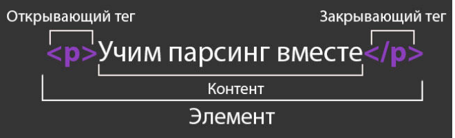
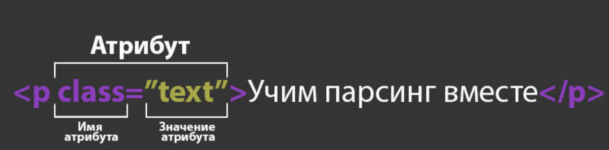

## Занятие 1: Введение в DOM и HTML

### Изучение DOM-дерева HTML
- **Что такое DOM?**
  - DOM (Document Object Model) представляет HTML-документ в виде дерева объектов, где каждый узел дерева представляет собой элемент, атрибут или текст.
  - DOM позволяет программно взаимодействовать с HTML-структурой, изменять её и извлекать данные.

- **Структура DOM:**
  - **Документ**: корневой узел, представляющий весь HTML-документ.
  - **Элементы**: узлы, представляющие теги HTML, такие как `<html>`, `<body>`, `<div>`, `<p>`, и т.д.
  - **Атрибуты**: узлы, содержащие дополнительные данные для элементов, например, `id`, `class`, `href`.
  - **Текст**: узлы, содержащие текстовые данные внутри элементов.

### Основные теги и структуры (теги, атрибуты, вложенность)
- **Основные HTML-теги:**
  - `<html>`: корневой элемент документа.
  - `<head>`: содержит метаданные документа (например, `<title>`, `<meta>`, `<link>`).
  - `<body>`: содержит видимое содержимое страницы (текст, изображения, ссылки).
  - **Блочные элементы**: `<div>`, `<h1>`, `<p>`, `<ul>`, `<ol>`.
  - **Встраиваемые элементы**: `<span>`, `<a>`, ``, `<strong>`, `<em>`.

  - Примеры:
    - абзацы `<р>`
    - списки: маркированные (с маркером) `<ul>` и нумерованные (с числами) `<ol>`
    - заголовки: от первого уровня `<h1>` до шестого уровня `<h6>`
    - статьи `<article>`
    - разделы `<section>`
    - длинные цитаты `<blockquote>`
    - блоки общего назначения `<div>`
  
- **Структура тега**
  
  1. **Открывающий тег (Opening tag)**: Состоит из имени элемента (в данном случае - "p"), заключенного в открывающие и закрывающие угловые скобки. Открывающий тег указывает, где элемент начинается или начинает действовать. В данном случае он сообщает, где начинается абзац.
  2. **Закрывающий тег (Closing tag)**: Выглядит так же, как открывающий тег, но с косой чертой перед именем элемента. Закрывающий элемент указывает, где элемент заканчивается, в данном случае - где заканчивается абзац. Отсутствие закрывающего тега является одной из наиболее распространенных ошибок начинающих и может приводить к
  странным результатам.
  3. **Контент (Content)**: Это контент элемента, который в данном случае является просто текстом.
  4. **Элемент(Element)**: Открывающий тег, закрывающий тег и контент вместе составляют элемент. Тег является контейнером, который заключает в себе содержимое. Есть одинарные теги, а есть парные. Считать открывающий тег и закрывающий тег разными объектами не правильно

- **Атрибуты HTML-элементов:**


Атрибут всегда должен иметь:
  1. Пробел между ним и именем элемента (или предыдущим атрибутом, если элемент уже имеет один или несколько атрибутов).
  2. Имя атрибута, за которым следует знак равенства.
  3. Значение атрибута, заключённое с двух сторон в кавычки.


  - Примеры атрибутов:
    - `id`: уникальный идентификатор элемента.
    - `class`: назначает элементу один или несколько классов.
    - `href`: указывает URL для ссылок.
    - `src`: указывает источник для изображений.

- **Вложенность элементов:**
  - Элементы могут содержать другие элементы, создавая иерархию. Например:
    ```html
    <div>
      <h1>Заголовок</h1>
      <p>Параграф текста.</p>
    </div>
    ```
  - Правильное использование вложенности важно для корректного отображения и семантики страницы.


### Использование инструментов разработчика в браузере для анализа DOM
- **Открытие инструментов разработчика:**
  - В Google Chrome и Firefox можно открыть инструменты разработчика нажатием клавиши F12 или правым кликом на странице и выбором "Просмотреть код" или "Исследовать элемент".

- **Интерфейс инструментов разработчика:**
  - **Элементы (Elements)**: отображает структуру DOM в виде дерева. Позволяет просматривать и изменять HTML и CSS в реальном времени.
  - **Консоль (Console)**: отображает сообщения об ошибках и позволяет выполнять JavaScript-код.
  - **Источник (Sources)**: позволяет просматривать и отлаживать JavaScript-код.
  - **Сеть (Network)**: отслеживает сетевые запросы и ответы, включая загрузку ресурсов.

### Инструменты разработчика в Firefox

#### Вкладка "Элементы"
- **Описание**: Вкладка "Элементы" (или "Inspector") позволяет просматривать и изменять HTML-код и CSS-стили на веб-странице в реальном времени. Это основной инструмент для анализа структуры и стилей документа.

- **Как использовать**:
  - **Поиск элементов**:
    - Кликните на элемент на веб-странице правой кнопкой мыши и выберите "Исследовать элемент" (или нажмите `Ctrl+Shift+C`), чтобы сразу перейти к этому элементу в панели "Элементы".
    - Или используйте панель поиска в верхней части вкладки "Элементы" для нахождения элемента по селектору или тегу.

  - **Редактирование HTML**:
    - Выберите элемент в дереве DOM. Вы можете кликнуть на него, чтобы редактировать его HTML-код. Для этого дважды щелкните на нужный элемент или правый клик -> "Edit as HTML".
    - Внесите изменения, такие как добавление, удаление или изменение тегов и атрибутов. Изменения будут сразу отображены на странице.

  - **Редактирование CSS**:
    - В правой части вкладки отображаются стили, примененные к выбранному элементу. Вы можете изменять существующие свойства или добавлять новые.
    - Для добавления или изменения стиля просто щелкните на свойство и введите новое значение. Вы увидите обновления на странице сразу же.

#### Вкладка "Консоль"
- **Описание**: Вкладка "Консоль" (или "Console") позволяет выполнять JavaScript-код и просматривать вывод, ошибки и предупреждения, связанные с выполнением скриптов на странице.

- **Как использовать**:
  - **Выполнение команд JavaScript**:
    - Введите JavaScript-код прямо в консоль и нажмите `Enter` для выполнения. Например:
      ```javascript
      document.querySelector('h1').textContent = 'Новый заголовок';
      ```
    - Это изменит текст содержимого первого элемента `<h1>` на странице.

  - **Просмотр сообщений и ошибок**:
    - Консоль отображает сообщения об ошибках, предупреждениях и других логах, связанных с JavaScript. Вы можете использовать это для отладки и диагностики проблем.

  - **Взаимодействие с DOM**:
    - Вы можете использовать консоль для быстрого тестирования и манипуляций с элементами DOM. Например, чтобы изменить атрибут элемента:
      ```javascript
      document.querySelector('img').setAttribute('src', 'new-image.jpg');
      ```

#### Вкладка "Сеть"
- **Описание**: Вкладка "Сеть" (или "Network") отображает все сетевые запросы, сделанные страницей, и позволяет анализировать их. Это полезно для отслеживания запросов к серверу и диагностики проблем с загрузкой ресурсов.

- **Как использовать**:
  - **Просмотр запросов**:
    - После открытия вкладки "Сеть", обновите страницу (нажмите `F5` или `Ctrl+R`), чтобы видеть все запросы, которые выполняются при загрузке.
    - Запросы отображаются в виде списка. Нажмите на любой запрос, чтобы увидеть подробности, такие как заголовки, параметры и тело запроса.

  - **Анализ ресурсов**:
    - Нажмите на запрос, чтобы просмотреть его детали. Включает заголовки запросов и ответов, данные и время загрузки.
    - Используйте вкладки "Headers", "Preview", "Response", и "Timing" для анализа различных аспектов запроса.

  - **Фильтрация и поиск**:
    - Используйте фильтры (например, "XHR", "JS", "CSS", "Images") для отображения только тех типов запросов, которые вам интересны.
    - Панель поиска позволяет искать запросы по URL, типу или другим параметрам.


### Ресурсы

- Сайт, используемый на занятии: https://rfspager.app/pager
- Если вы хотите узнать про HTML больше, вы можете посмотреть следующий ролик на youtube (https://www.youtube.com/watch?v=W4MIiV4nZDY&ab_channel=BogdanStashchuk). 


