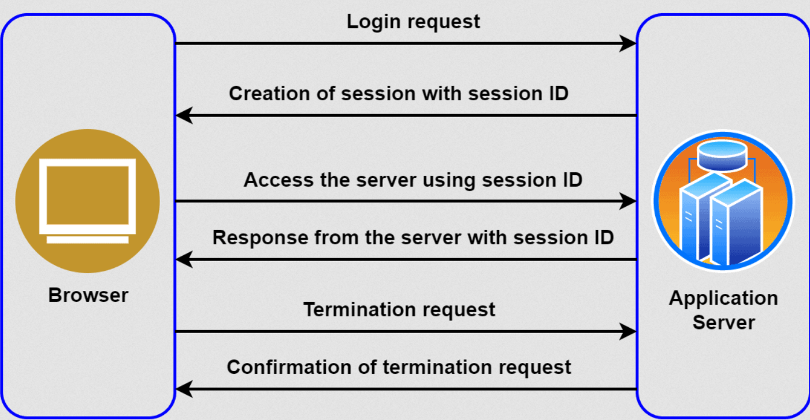

# Занятие 9: Работа с cookies и сессиями в requests

## 1. Cookies

### Основные понятия
- **Cookies**: Маленькие фрагменты данных, которые сервер отправляет клиенту и которые клиент возвращает серверу при последующих запросах. Cookies используются для хранения информации о пользователе, такой как сессии, предпочтения и другие данные, которые могут быть полезны для взаимодействия с веб-сайтами.
- **Свойства Cookies**:
  - **Name**: Имя cookie.
  - **Value**: Значение cookie.
  - **Domain**: Домен, для которого cookie действительны.
  - **Path**: Путь, для которого cookie действительны.
  - **Expires/Max-Age**: Время жизни cookie.
  - **Secure**: Указывает, что cookie передается только по защищенному протоколу (HTTPS).
  - **HttpOnly**: Указывает, что cookie не доступен через JavaScript (только серверный доступ).

### Чтение cookies из ответа
- **Описание**: Сервер может отправить cookies в ответе на запрос, и эти cookies могут быть использованы в последующих запросах.
- **Пример кода**:
  ```python
  import requests

  # Выполняем запрос
  response = requests.get('https://rfspager.app/pager')

  # Читаем cookies из ответа
  cookies = response.cookies

  # Преобразуем cookies в словарь
  cookies_dict = cookies.get_dict()

  # Выводим cookies
  print(cookies_dict)
  ```
  **Объяснение**: После выполнения запроса, мы можем получить cookies из объекта ответа с помощью `response.cookies`. Метод `get_dict()` позволяет преобразовать cookies в удобный словарь.

### Отправка cookies в запросе
- **Описание**: Когда вы хотите отправить cookies на сервер при выполнении запроса, вы можете передать их в заголовке `Cookie` вашего запроса.
- **Пример кода**:
  ```python
  import requests

  # Определяем cookies
  cookies = {
      'session_id': '123456789',
      'user_id': 'user123'
  }

  # Отправляем GET-запрос с cookies
  response = requests.get('https://example.com/profile', cookies=cookies)
  
  # Выводим ответ
  print(response.text)
  ```
  **Объяснение**: В данном примере мы создаем словарь с cookies и передаем его в параметр `cookies` метода `requests.get()`. Эти cookies будут отправлены серверу вместе с запросом.


## 2. Proxy

### Основные понятия
- **Прокси-сервер**: Это промежуточный сервер, через который проходят запросы от клиента к целевому серверу. Прокси может выполнять функции фильтрации, кэширования, а также скрытия реального IP-адреса клиента.  

- **Типы прокси**:
  - **HTTP Proxy**: Используется для HTTP-запросов.
  - **HTTPS Proxy**: Используется для HTTPS-запросов, обеспечивая защиту при передаче данных.
  - **SOCKS Proxy**: Более универсальный прокси, который может обрабатывать различные протоколы, включая TCP и UDP.
- **Преимущества использования прокси**:
  - **Анонимность**: Скрытие реального IP-адреса клиента.
  - **Доступ к заблокированным ресурсам**: Обход блокировок и ограничений.
  - **Кэширование**: Ускорение доступа к часто запрашиваемым ресурсам.

### Интеграция прокси
- **Описание**: Настройка прокси-сервера в библиотеке `requests` осуществляется путем передачи прокси-серверов в параметрах запроса или сессии.
- **Пример кода**:
  ```python
  import requests

  # Настраиваем прокси для HTTP и HTTPS
  proxies = {
      'http': 'http://proxy.example.com:8080',
      'https': 'https://proxy.example.com:8080',
  }

  # Выполняем запрос с использованием прокси
  response = requests.get('https://ifconfig.me', proxies=proxies)

  # Выводим содержимое ответа
  print(response.text)
  ```
  **Объяснение**: В данном примере мы настраиваем прокси для HTTP и HTTPS запросов и передаем их в параметр `proxies` метода `requests.get()`. Это гарантирует, что запросы будут направляться через указанные прокси-серверы.

### Работа с аутентификацией прокси
- **Описание**: Некоторые прокси-серверы требуют аутентификацию. Это может быть выполнено с помощью предоставления имени пользователя и пароля.
- **Пример кода**:
  ```python
  import requests
  from requests.auth import HTTPProxyAuth

  # Настраиваем прокси и аутентификацию
  proxies = {
      'http': 'http://proxy.example.com:8080',
      'https': 'https://proxy.example.com:8080',
  }
  #
  # proxies = {
  #   "http": f"http://{PROXY_USERNAME}:{PROXY_PASSWORD}@{PROXY_ENDPOINT}",
  #   "https": f"http://{PROXY_USERNAME}:{PROXY_PASSWORD}@{PROXY_ENDPOINT}",
  # }

  auth = HTTPProxyAuth('username', 'password')

  # Выполняем запрос с использованием прокси и аутентификации
  response = requests.get('https://ifconfig.me', proxies=proxies, auth=auth)

  # Выводим содержимое ответа
  print(response.text)
  ```
  **Объяснение**: В данном примере мы используем `HTTPProxyAuth` для предоставления имени пользователя и пароля прокси-серверу. Это необходимо для аутентифицированного доступа к прокси-серверу.

### Обработка ошибок прокси
- **Описание**: При работе с прокси-серверами могут возникать различные ошибки, такие как недоступность прокси, неверные настройки или проблемы с аутентификацией. Важно правильно обрабатывать эти ошибки.
- **Пример кода**:
  ```python
  import requests
  from requests.exceptions import ProxyError, RequestException

  # Настраиваем прокси
  proxies = {
      'http': 'http://invalid-proxy.example.com:8080',
      'https': 'https://invalid-proxy.example.com:8080',
  }

  try:
      # Выполняем запрос с использованием прокси
      response = requests.get('https://example.com', proxies=proxies)
      response.raise_for_status()  # Проверка на HTTP ошибки
  except ProxyError:
      print("Ошибка: Прокси-сервер недоступен.")
  except RequestException as e:
      print(f"Ошибка: {e}")
  else:
      print(response.text)
  ```
  **Объяснение**: В этом примере мы обрабатываем исключение `ProxyError`, которое возникает, если прокси-сервер недоступен. Использование `RequestException` позволяет ловить любые другие ошибки, связанные с запросом. Метод `raise_for_status()` проверяет наличие HTTP ошибок в ответе.

## 3. Сессии

### Основные понятия
- **Сессия**: В контексте HTTP-запросов и библиотеки `requests`, сессия (`Session`) — это объект, который сохраняет состояние между запросами. Это включает в себя сохранение cookies, параметров соединения и любых других настроек, которые должны сохраняться между запросами.

- **Преимущества использования сессии**:
  - **Управление cookies**: Сессии автоматически сохраняют и отправляют cookies между запросами.
  - **Настройки подключения**: Можно задать параметры подключения (например, прокси) и они будут применяться ко всем запросам в рамках сессии.
  - **Эффективность**: Сессии могут быть более эффективными, так как поддерживают постоянное соединение с сервером.

### Создание и использование сессии
- **Описание**: Для создания сессии используется класс `Session` из библиотеки `requests`. Этот объект можно использовать для выполнения HTTP-запросов с сохранением состояния между ними.
- **Пример кода**:
  ```python
  import requests

  # Создаем объект сессии
  session = requests.Session()

  # Выполняем запрос с использованием сессии
  response = session.get('https://example.com')

  # Выводим содержимое ответа
  print(response.text)
  ```
  **Объяснение**: В этом примере создается объект `Session`, и выполняется GET-запрос с использованием этого объекта. Все запросы через этот объект будут сохранять состояние, которое установлено в `Session`.

### Хранение и использование cookies в сессиях
- **Описание**: При использовании объекта `Session`, cookies автоматически сохраняются между запросами. Это позволяет поддерживать состояние пользователя, такой как авторизация или пользовательские настройки.
- **Пример кода**:
  ```python
  import requests

  # Создаем объект сессии
  session = requests.Session()

  # Отправляем запрос на авторизацию
  response1 = session.post('https://example.com/login', data={'username': 'user', 'password': 'pass'})

  # Проверяем cookies после авторизации
  print("Cookies после авторизации:", session.cookies.get_dict())

  # Выполняем запрос в рамках той же сессии
  response2 = session.get('https://example.com/profile')

  # Выводим содержимое страницы профиля
  print(response2.text)
  ```
  **Объяснение**: В данном примере с помощью POST-запроса мы авторизуемся на сайте, и cookies, установленные в процессе авторизации, автоматически сохраняются в объекте `Session`. Эти cookies затем используются для доступа к защищенным страницам.

### Сессии и прокси
- **Описание**: Вы можете настроить прокси для объекта `Session`, чтобы все запросы, выполненные в рамках этой сессии, использовали указанный прокси-сервер.
- **Пример кода**:
  ```python
  import requests

  # Создаем объект сессии
  session = requests.Session()

  # Настраиваем прокси для сессии
  session.proxies = {
      'http': 'http://proxy.example.com:8080',
      'https': 'https://proxy.example.com:8080',
  }

  # Выполняем запрос с использованием прокси
  response = session.get('https://example.com')

  # Выводим содержимое ответа
  print(response.text)
  ```
  **Объяснение**: В данном примере прокси-серверы настроены для HTTP и HTTPS запросов. Все запросы, выполненные через объект `Session`, будут проходить через указанные прокси-серверы.
